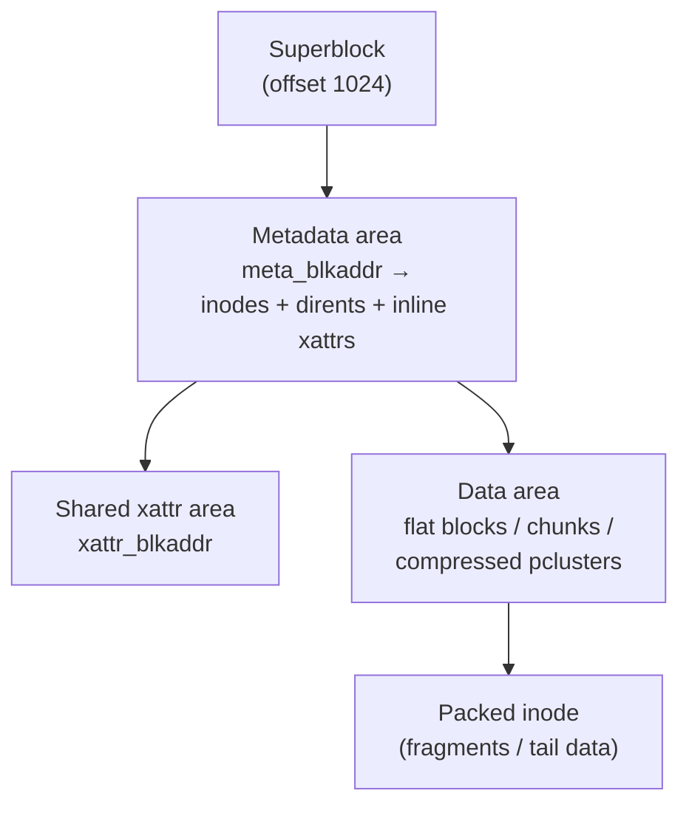
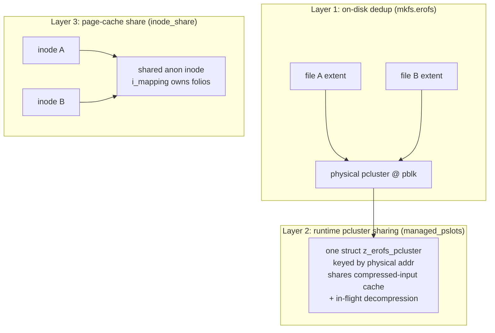
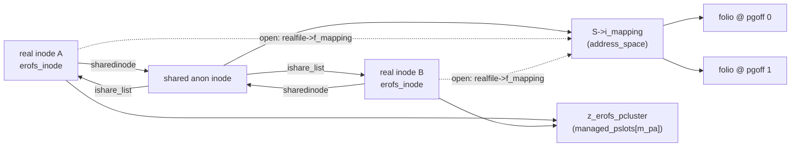

* TOC
{:toc}

# Overview

EROFS (Enhanced Read-Only File System) can serve reads for *different
files that have identical content* from a **single set of page-cache
folios**, so the same `.so` shared library in two slightly-different
container images costs one copy of RAM instead of two. This post
explains exactly how that works in Linux v7.0: the on-disk
deduplication done by `mkfs.erofs`, the runtime sharing of compressed
pclusters, and — the real subject here — the `inode_share` page-cache
sharing feature, where a hidden *shared anonymous inode* owns the
folios and every matching real inode routes its reads and mmaps into
that one `address_space`.

The single most important thing to keep straight is that EROFS has
**three distinct sharing layers** that operate on different objects and
save different resources. We separate them carefully, then trace the
read, mmap, and readahead paths through the actual kernel functions,
identify which `address_space` owns each folio, and finish with
runnable Python that parses the on-disk metadata that drives all of
this.

> Based on Linux **v7.0**. The page-cache sharing feature was merged for
> v7.0-rc1; key commits: `5ef3208e3be5` ("erofs: introduce the page
> cache share feature"), `34096ba919fd` (unencoded inodes),
> `9364b55a4dbf` (compressed inodes), `e0bf7d1c074d` (user-defined
> fingerprint), `4340ca47c35b` (decouple `erofs_anon_fs_type`),
> `03c0d030f587` ("allow sharing page cache with the same aops only"),
> `d86d7817c042`/`2f0407ed923b` (`.fadvise`). Primary sources:
> [`fs/erofs/ishare.c`](https://git.kernel.org/pub/scm/linux/kernel/git/torvalds/linux.git/tree/fs/erofs/ishare.c?h=v7.0),
> [`fs/erofs/data.c`](https://git.kernel.org/pub/scm/linux/kernel/git/torvalds/linux.git/tree/fs/erofs/data.c?h=v7.0),
> [`fs/erofs/zdata.c`](https://git.kernel.org/pub/scm/linux/kernel/git/torvalds/linux.git/tree/fs/erofs/zdata.c?h=v7.0),
> [`fs/erofs/inode.c`](https://git.kernel.org/pub/scm/linux/kernel/git/torvalds/linux.git/tree/fs/erofs/inode.c?h=v7.0),
> [`fs/erofs/internal.h`](https://git.kernel.org/pub/scm/linux/kernel/git/torvalds/linux.git/tree/fs/erofs/internal.h?h=v7.0),
> [`fs/erofs/erofs_fs.h`](https://git.kernel.org/pub/scm/linux/kernel/git/torvalds/linux.git/tree/fs/erofs/erofs_fs.h?h=v7.0).

Generated by AI.

# Why Page Cache Sharing Matters

The motivating workload is **immutable, content-addressable images
mounted many times**:

- **Container / OCI layers.** Two minor versions of the same image
  (`redis:7.2.4` and `redis:7.2.5`) differ in a handful of files but
  ship the same `libc`, the same interpreter, the same megabytes of
  shared libraries. Mounted as two EROFS images at two mount points,
  the kernel normally caches every byte twice.
- **Android system / vendor partitions.** Read-only, compressed, and
  frequently containing duplicate assets across partitions.
- **Immutable rootfs and firmware images.** Same story: identical files
  appear under different paths or different mounts.

The upstream measurements that justified the feature (commit
`34096ba919fd`) read *all* files from two minor image versions and
compare RSS:

| Image (two minor versions) | Sharing off | Sharing on | Reduction |
|---|---|---|---|
| redis 7.2.4 & 7.2.5 | 241 MB | 163 MB | 33% |
| postgres 16.1 & 16.2 | 872 MB | 630 MB | 28% |
| nginx | 390 MB | 219 MB | 44% |
| tomcat 10.1.25 & 10.1.26 | 924 MB | 474 MB | 49% |

The savings are real because the dominant cost is the **decompressed
page cache**, not the on-disk bytes. Deduplicating disk (which
`mkfs.erofs` already does) does not by itself deduplicate RAM — that is
the gap the `inode_share` feature closes.

# User View

Two files, identical content, different paths:

```bash
# imageA.erofs and imageB.erofs both contain a byte-identical libfoo.so.6
mount -t erofs -o ro,inode_share,domain_id=trusted imageA.erofs /mnt/a
mount -t erofs -o ro,inode_share,domain_id=trusted imageB.erofs /mnt/b

cat /mnt/a/usr/lib/libfoo.so.6 > /dev/null   # cold: read from disk + decompress
cat /mnt/b/usr/lib/libfoo.so.6 > /dev/null   # warm: served from shared cache
```

What the user sees: two ordinary files, two `struct inode`s, two
distinct `stat()` results (different `st_ino`, different mounts). What
the user does *not* see: the second `cat` performs **no disk I/O and no
decompression** — it reuses folios already populated by the first
`cat`. You can confirm with `/proc/meminfo` (Cached barely moves on the
second read) or by watching block I/O counters.

The trust boundary is explicit: `inode_share` is paired with
`domain_id`. Only images mounted into the *same* `domain_id` are
allowed to share, because sharing a folio means sharing the bytes —
you must trust that two images claiming the same content really have
it. EROFS does **not** hash the data at runtime to prove equality (see
[§4](#4-erofs-shared-data-design)); it trusts a fingerprint baked into
the image.

# High-Level EROFS Architecture

EROFS is a flat, write-once layout. The address space of the device is
divided into three regions, all in units of the filesystem block
(`blksz = 1 << sb->blkszbits`, typically 4 KiB):



Core concepts:

- **nid** — *node id*, a 64-bit handle for an inode. Its location is
  computed arithmetically, not looked up:
  `iloc(nid) = meta_blkaddr * blksz + (nid << islotbits)` where
  `islotbits = log2(32) = 5` (the inode slot unit is the 32-byte compact
  inode). See `erofs_iloc()` in
  [`internal.h:333`](https://git.kernel.org/pub/scm/linux/kernel/git/torvalds/linux.git/tree/fs/erofs/internal.h?h=v7.0).
- **inode** — 32-byte compact (`erofs_inode_compact`) or 64-byte
  extended (`erofs_inode_extended`) on-disk record, immediately
  followed by inline xattrs and, for some layouts, the inline data or
  the compression map header.
- **datalayout** — how the file body is stored (the 3-bit field in
  `i_format`): `FLAT_PLAIN`, `FLAT_INLINE`, `CHUNK_BASED`,
  `COMPRESSED_FULL`, `COMPRESSED_COMPACT`.
- **logical cluster (lcluster)** — the unit of the compression map: a
  fixed-size run of *logical* (decompressed) file bytes,
  `1 << z_lclusterbits` (usually one block).
- **pcluster (physical cluster)** — a run of *physical* (compressed)
  blocks on disk that decompresses to one or more lclusters. The
  pcluster, identified by its starting physical address, is the unit of
  decompression and the unit of runtime sharing.

# EROFS Shared Data Design

EROFS deduplicates at three levels. Keeping them apart is the whole
game.



**Layer 1 — on-disk deduplication** (`EROFS_FEATURE_INCOMPAT_DEDUPE`,
done at image build time). When `mkfs.erofs` finds two regions with the
same compressed bytes, it stores the pcluster once and makes both
files' compression maps point at the same physical address; partial
references are marked with `Z_EROFS_LI_PARTIAL_REF`
([`erofs_fs.h:399`](https://git.kernel.org/pub/scm/linux/kernel/git/torvalds/linux.git/tree/fs/erofs/erofs_fs.h?h=v7.0)).
This saves **disk space**. By itself it saves *no* page cache: two
inodes still have two `address_space`s, so reading both fills two sets
of decompressed folios.

**Layer 2 — runtime pcluster sharing.** When two inodes (or two ranges)
reference the *same physical pcluster*, the in-core
`struct z_erofs_pcluster` is found in a per-superblock xarray keyed by
the pcluster's physical address (`map->m_pa`). Both readers attach to
the same pcluster object, share its **managed compressed-page cache**,
and coalesce **in-flight decompression**. This saves redundant disk
reads of compressed input and avoids decompressing the same pcluster
twice *concurrently*. It still does **not** share the decompressed
output cache: the output folios are inserted into each reader's own
`i_mapping`.

**Layer 3 — page-cache sharing** (`CONFIG_EROFS_FS_PAGE_CACHE_SHARE`,
`inode_share` mount option). This is whole-file content dedup at the
*page-cache* level. A hidden shared inode owns the decompressed (or
plain) folios, and every real inode with matching content routes its
reads into that shared `address_space`. This is the only layer that
deduplicates the bytes the user actually reads. Everything below is
about Layer 3.

The dedup *key* for Layer 3 is **not** a runtime content hash. It is a
**fingerprint xattr** written into each inode by `mkfs.erofs` (commit
`e0bf7d1c074d`, gated by `EROFS_FEATURE_COMPAT_ISHARE_XATTRS`). The
fingerprint is typically a content digest; the kernel reads it back and
treats equal fingerprints as equal content. Trust, not verification —
hence the `domain_id` boundary.

# Metadata Walkthrough — From read() to EROFS

Before the sharing-specific paths, here is the spine that every read
travels:

```text
read(fd)
  -> ksys_read -> vfs_read
  -> file->f_op->read_iter            # which read_iter? depends on i_fop
  -> filemap_read                     # page cache lookup
       -> filemap_get_pages
            -> page_cache_ra_*        # readahead on miss
                 -> aops->readahead / aops->read_folio
                      -> erofs_readahead / z_erofs_readahead   (EROFS)
```

The branch that matters: at `erofs_fill_inode()`
([`inode.c:223`](https://git.kernel.org/pub/scm/linux/kernel/git/torvalds/linux.git/tree/fs/erofs/inode.c?h=v7.0))
a regular file is given **one of two** `file_operations`:

```c
case S_IFREG:
    inode->i_op = &erofs_generic_iops;
    inode->i_fop = erofs_ishare_fill_inode(inode) ?
                   &erofs_ishare_fops : &erofs_file_fops;
```

`erofs_ishare_fill_inode()` returns true only when `inode_share` is on
*and* the inode carries a valid fingerprint xattr. If it returns true,
the file gets `erofs_ishare_fops`, whose `read_iter`/`mmap` redirect
into the shared inode. Otherwise it gets the ordinary
`erofs_file_fops`. Either way the inode's own
`i_mapping->a_ops` is set by `erofs_get_aops()` to one of
`erofs_aops` (plain), `z_erofs_aops` (compressed),
`erofs_fileio_aops`, or `erofs_fscache_access_aops`
([`internal.h:473`](https://git.kernel.org/pub/scm/linux/kernel/git/torvalds/linux.git/tree/fs/erofs/internal.h?h=v7.0)).

The metadata objects encountered per read:

1. **inode** — located by nid, read by `erofs_read_inode()`.
2. **fingerprint xattr** — read by
   `erofs_xattr_fill_inode_fingerprint()`
   ([`xattr.c:618`](https://git.kernel.org/pub/scm/linux/kernel/git/torvalds/linux.git/tree/fs/erofs/xattr.c?h=v7.0)),
   the dedup key.
3. **extent / chunk / compression map** — resolved by
   `erofs_map_blocks()` (uncompressed/chunk) or
   `z_erofs_map_blocks_iter()` (compressed) into an
   `erofs_map_blocks {m_la, m_pa, m_plen, m_llen, m_flags}`.
4. **pcluster** — for compressed data, found/created in
   `sbi->managed_pslots`.

# How Shared Inodes Work

The shared inode lives on a **separate, kernel-internal anonymous
filesystem mount**, not on the EROFS image. `erofs_init_ishare()`
([`ishare.c:209`](https://git.kernel.org/pub/scm/linux/kernel/git/torvalds/linux.git/tree/fs/erofs/ishare.c?h=v7.0))
does `kern_mount(&erofs_anon_fs_type)` once at module init; the
filesystem type is the trivial `pseudo_erofs` pseudo-fs
([`super.c:993`](https://git.kernel.org/pub/scm/linux/kernel/git/torvalds/linux.git/tree/fs/erofs/super.c?h=v7.0)).
All shared inodes, across every mounted EROFS image, live in this one
super block's inode hash.

A shared inode is keyed by fingerprint. The per-real-inode and
per-shared-inode state share a union in `struct erofs_inode`
([`internal.h:310`](https://git.kernel.org/pub/scm/linux/kernel/git/torvalds/linux.git/tree/fs/erofs/internal.h?h=v7.0)):

```c
#ifdef CONFIG_EROFS_FS_PAGE_CACHE_SHARE
    struct list_head ishare_list;
    union {
        struct {                                  /* the shared anon inode */
            struct erofs_inode_fingerprint fingerprint;
            spinlock_t ishare_lock;
        };
        struct inode *sharedinode;                /* a real EROFS inode */
    };
#endif
```

`erofs_ishare_fill_inode()`
([`ishare.c:40`](https://git.kernel.org/pub/scm/linux/kernel/git/torvalds/linux.git/tree/fs/erofs/ishare.c?h=v7.0))
is the heart of the lookup:

```c
aops = erofs_get_aops(inode, true);               // infer plain vs compressed
erofs_xattr_fill_inode_fingerprint(&fp, inode, sbi->domain_id);
hash = xxh32(fp.opaque, fp.size, 0);              // hash bucket
sharedinode = iget5_locked(erofs_ishare_mnt->mnt_sb, hash,
                           erofs_ishare_iget5_eq,  // exact compare of fp bytes
                           erofs_ishare_iget5_set, &fp);

if (sharedinode is I_NEW) {                        // first inode with this content
    sharedinode->i_mapping->a_ops = aops;          // remember its aops
    sharedinode->i_size = inode->i_size;
    unlock_new_inode(sharedinode);
} else {                                            // subsequent matching inode
    if (aops != sharedinode->i_mapping->a_ops) return false;  // §"same aops only"
    if (sharedinode->i_size != inode->i_size)      return false;  // mismatch guard
}
vi->sharedinode = sharedinode;
list_add(&vi->ishare_list, &EROFS_I(sharedinode)->ishare_list);  // register back-link
```

Three invariants enforced here:

- **Hash + exact compare.** `xxh32` chooses the bucket;
  `erofs_ishare_iget5_eq()` compares the raw fingerprint bytes and size,
  so a hash collision cannot merge two different contents.
- **Same aops only** (commit `03c0d030f587`). A compressed file and a
  plain file may not share a shared inode even with the same
  fingerprint, because the folios are managed by different subsystems —
  `z_erofs_aops` knows how to decompress, `erofs_aops` does not. The
  shared inode remembers the first real inode's aops and rejects
  mismatches.
- **Size match.** A defensive check; equal fingerprint with unequal
  size is rejected and logged.

Each real inode holds a reference to its shared inode (`iget5_locked`
grabs it) and links itself onto the shared inode's `ishare_list`.
`erofs_ishare_free_inode()` reverses this on eviction: unlink from the
list and `iput(sharedinode)`. When the last real inode drops, the
shared inode's refcount hits zero and it is freed
(`erofs_anon_sops.drop_inode = inode_just_drop`).

# How Shared Page Cache Works

This is the core. The contrast with a normal filesystem is exact.

## Normal filesystem

```text
inode A ── address_space A ── folio X (offset 0..4K of A)
inode B ── address_space B ── folio Y (offset 0..4K of B)
```

Even if X and Y hold identical bytes, they are distinct folios in
distinct `i_mapping`s, indexed independently. RAM is duplicated.

## EROFS with inode_share

```text
inode A (erofs_ishare_fops) ─┐
                             ├──► shared anon inode S
inode B (erofs_ishare_fops) ─┘        └── S->i_mapping ── folio X (offset 0..4K)
```

There is exactly **one** `address_space` (`S->i_mapping`) and exactly
one folio per file offset. Both A and B discover it.

### How a read reaches the shared mapping

When the file is opened, `erofs_ishare_file_open()`
([`ishare.c:103`](https://git.kernel.org/pub/scm/linux/kernel/git/torvalds/linux.git/tree/fs/erofs/ishare.c?h=v7.0))
builds a *backing file* that points at the shared inode's mapping:

```c
realfile = alloc_empty_backing_file(O_RDONLY|O_NOATIME, current_cred(), file);
ihold(sharedinode);
realfile->f_op       = &erofs_file_fops;          // the normal EROFS fops
realfile->f_inode    = sharedinode;
realfile->f_mapping  = sharedinode->i_mapping;     // <-- the shared cache
file->private_data   = realfile;                   // stash on the user's file
```

`O_DIRECT` is rejected outright (you cannot bypass a shared cache and
keep it coherent). Then `read()` lands in
`erofs_ishare_file_read_iter()`
([`ishare.c:137`](https://git.kernel.org/pub/scm/linux/kernel/git/torvalds/linux.git/tree/fs/erofs/ishare.c?h=v7.0)):

```c
struct file *realfile = iocb->ki_filp->private_data;
kiocb_clone(&dedup_iocb, iocb, realfile);          // retarget the kiocb at realfile
nread = filemap_read(&dedup_iocb, to, 0);          // read from shared mapping
iocb->ki_pos = dedup_iocb.ki_pos;
```

`filemap_read()` operates on `realfile->f_mapping == S->i_mapping`.
Folios are looked up and inserted in the *shared* mapping, indexed by
**logical file offset** (`pgoff = offset >> PAGE_SHIFT`). Because every
real inode that shares S has byte-identical content and equal size,
offset N means the same bytes for all of them — so the index is a valid
shared key.

### Who owns the folios, who supplies the on-disk map

The shared inode owns the folios but has **no on-disk backing of its
own** — it is an anonymous inode with no nid, no blocks, no compression
map. When the page cache misses and calls
`S->i_mapping->a_ops->read_folio/readahead`, EROFS must obtain the
actual disk layout. It borrows it from *any one* real inode via
`erofs_real_inode()`
([`ishare.c:183`](https://git.kernel.org/pub/scm/linux/kernel/git/torvalds/linux.git/tree/fs/erofs/ishare.c?h=v7.0)):

```c
struct inode *erofs_real_inode(struct inode *inode, bool *need_iput) {
    if (!erofs_is_ishare_inode(inode)) return inode;   // not a shared inode
    spin_lock(&vi_share->ishare_lock);
    list_for_each_entry(vi, &vi_share->ishare_list, ishare_list) {
        realinode = igrab(&vi->vfs_inode);             // grab the first live one
        if (realinode) { *need_iput = true; break; }
    }
    spin_unlock(&vi_share->ishare_lock);
    return realinode;
}
```

Any member of `ishare_list` will do, since they all map to identical
content. The folio lives in S's mapping; the *mapping* (extent →
physical block, or pcluster → decompression) comes from the borrowed
real inode. This split — **folio owned by shared inode, layout
borrowed from a real inode** — is the crux of the whole design.

### Avoiding redundant decompression

The payoff: the *first* reader of a given offset populates the shared
folio (uncompressed copy or decompressed output), marks it uptodate,
and unlocks it. The *second* reader — possibly through a different real
inode in a different mount — calls `filemap_read()` on the same shared
mapping, finds the folio already uptodate, and returns it **without any
disk read and without any decompression**. One decompression, one cache
entry, N readers.

# Read Path Deep Dive

## Uncompressed (FLAT_PLAIN / FLAT_INLINE / CHUNK_BASED)

```text
filemap_read (on S->i_mapping)
  -> erofs_readahead / erofs_read_folio            (data.c)
       realinode = erofs_real_inode(S)             (borrow layout owner)
       -> iomap_readahead/iomap_read_folio(&erofs_iomap_ops, ctx{realinode})
            -> erofs_iomap_begin                    (data.c:290)
                 realinode = ctx->realinode
                 erofs_map_blocks(realinode, &map)  -> m_pa (physical addr)
                 erofs_map_dev(...)                 -> bdev + addr
            -> submit bio, read into the shared folio
       if need_iput: iput(realinode)
```

The key lines, `erofs_read_folio()`
([`data.c:395`](https://git.kernel.org/pub/scm/linux/kernel/git/torvalds/linux.git/tree/fs/erofs/data.c?h=v7.0)):

```c
struct erofs_iomap_iter_ctx iter_ctx = {
    .realinode = erofs_real_inode(folio_inode(folio), &need_iput),
};
iomap_read_folio(&erofs_iomap_ops, &read_ctx, &iter_ctx);
```

`erofs_iomap_begin()` then uses `ctx->realinode`, *not* the folio's
host inode, for `erofs_map_blocks()`. The bio's destination is the
folio from the shared mapping; its source is the physical block the
real inode points to. EROFS uses iomap as its block-mapping engine here
(`erofs_iomap_ops`).

## Compressed (COMPRESSED_FULL / COMPRESSED_COMPACT)

```text
filemap_read (on S->i_mapping)
  -> z_erofs_readahead / z_erofs_read_folio         (zdata.c:1880,1908)
       sharedinode = folio->mapping->host
       realinode   = erofs_real_inode(sharedinode)
       FRONTEND f = { .inode = realinode, .sharedinode = sharedinode }
       -> z_erofs_scan_folio(&f, folio)
            -> z_erofs_map_blocks_iter(realinode, &map)   # compression map
            -> z_erofs_pcluster_begin(&f)
                 pcl = xa_load(&sbi->managed_pslots, map->m_pa)   # shared pcluster!
                 if (!pcl) z_erofs_register_pcluster(&f)          # insert keyed by m_pa
            -> attach folio to pcluster as an output buffer
       -> z_erofs_runqueue(&f)   # read compressed input, decompress into folios
```

Note the frontend carries **both** inodes: `f->inode` (the real inode,
for the compression map) and `f->sharedinode` (whose `i_mapping` owns
the output folios). When readahead allocates more output folios it pulls
them from the shared mapping
([`zdata.c:1865`](https://git.kernel.org/pub/scm/linux/kernel/git/torvalds/linux.git/tree/fs/erofs/zdata.c?h=v7.0)):

```c
folio = erofs_grab_folio_nowait(f->sharedinode->i_mapping, index);
```

The pcluster lookup
([`zdata.c:830`](https://git.kernel.org/pub/scm/linux/kernel/git/torvalds/linux.git/tree/fs/erofs/zdata.c?h=v7.0))
is where **Layer 2** sharing happens, independent of Layer 3:

```c
pcl = xa_load(&EROFS_SB(sb)->managed_pslots, map->m_pa);   // keyed by physical addr
```

`managed_pslots` is keyed by `map->m_pa`, the physical pcluster
address. Any two reads of the same physical pcluster — same file,
different files, different inodes — find the same `z_erofs_pcluster`,
share its compressed-input cache, and merge concurrent decompression.

# mmap Path Deep Dive

`mmap()` must back the VMA with the shared inode's mapping so that page
faults populate (and reuse) the shared folios. `erofs_ishare_mmap()`
([`ishare.c:152`](https://git.kernel.org/pub/scm/linux/kernel/git/torvalds/linux.git/tree/fs/erofs/ishare.c?h=v7.0)):

```c
static int erofs_ishare_mmap(struct file *file, struct vm_area_struct *vma) {
    struct file *realfile = file->private_data;
    vma_set_file(vma, realfile);                       // VMA's file -> backing file
    err = security_mmap_backing_file(vma, realfile, file);
    if (err) return err;
    return generic_file_readonly_mmap(file, vma);      // read-only, shared mapping
}
```

`vma_set_file()` retargets the VMA at `realfile`, whose `f_mapping` is
`S->i_mapping`. From then on the fault path is the generic one:

```text
page fault -> filemap_fault -> filemap_get_folio(S->i_mapping, pgoff)
   hit  -> map existing shared folio into the faulting process
   miss -> S->i_mapping->a_ops->read_folio (same as the read path above)
```

Differences from buffered `read()`:

- The mapping is read-only (`generic_file_readonly_mmap`); writes are
  rejected, which is exactly right for a read-only, shared-content fs.
- Faults go through `filemap_fault` rather than `filemap_read`, but
  both resolve folios in the **same** `S->i_mapping`. So a process that
  `read()`s file A and another that `mmap()`s file B share the *same
  physical pages* — the page tables of both point at one folio.
- `security_mmap_backing_file()` (LSM hook added by `6af36aeb147a`)
  lets the security layer see the real backing file, not just the
  user-facing one.

# Readahead Path

Readahead is where sharing pays off in throughput, because the *first*
reader prefetches into the shared mapping and the *second* reader's
readahead becomes a series of cache hits.

For uncompressed files, `erofs_readahead()` mirrors `erofs_read_folio`
but drives `iomap_readahead()` over the whole `readahead_control`
window, again with the borrowed `realinode` supplying the layout.

For compressed files, `z_erofs_readahead()`
([`zdata.c:1908`](https://git.kernel.org/pub/scm/linux/kernel/git/torvalds/linux.git/tree/fs/erofs/zdata.c?h=v7.0))
adds two performance tricks on top of sharing:

```c
while ((folio = readahead_folio(rac))) {     // collect the window into a list
    folio->private = head; head = folio;
}
while (head) {                                // process in reverse order
    folio = head; head = folio_get_private(folio);
    z_erofs_scan_folio(&f, folio, true);      // group folios by pcluster
}
z_erofs_runqueue(&f, nrpages << PAGE_SHIFT);  // batch-submit + batch-decompress
```

- **Reverse-order traversal** improves metadata I/O locality.
- **pcluster batching**: folios that map to the same pcluster are
  attached to one `z_erofs_pcluster` and decompressed together, so a
  single decompression fills many output folios.
- `z_erofs_pcluster_readmore()` may call `readahead_expand()` to widen
  the window to pcluster boundaries — decompression is all-or-nothing
  per pcluster, so reading a partial pcluster is wasteful.

Combined with Layer 3, the second file's readahead over the shared
mapping finds the folios already uptodate and skips both submission and
decompression entirely.

# Kernel Data Structures

### `struct erofs_inode` — [`internal.h:275`](https://git.kernel.org/pub/scm/linux/kernel/git/torvalds/linux.git/tree/fs/erofs/internal.h?h=v7.0)

The in-core inode; `EROFS_I(vfs_inode)` recovers it via `container_of`.

| Field | Purpose |
|---|---|
| `nid` | on-disk inode id; drives `erofs_iloc()` |
| `datalayout` | plain / inline / chunk / compressed — picks the aops |
| `startblk` / `chunk*` / `z_*` | layout-specific body locators (a union) |
| `ishare_list` | links real inodes under a shared inode (or heads the list on a shared inode) |
| `fingerprint` + `ishare_lock` | *(shared inode only)* dedup key + list lock |
| `sharedinode` | *(real inode only)* pointer to the shared inode that owns its cache |
| `vfs_inode` | the embedded `struct inode` |

### `struct erofs_inode_fingerprint` — [`internal.h:270`](https://git.kernel.org/pub/scm/linux/kernel/git/torvalds/linux.git/tree/fs/erofs/internal.h?h=v7.0)

`{ u8 *opaque; int size; }` — the dedup key. `opaque` is the raw bytes
of the fingerprint xattr value, with `domain_id` appended. Hashed by
`xxh32` for bucketing, compared byte-for-byte for equality.

### `struct erofs_sb_info` — [`internal.h`](https://git.kernel.org/pub/scm/linux/kernel/git/torvalds/linux.git/tree/fs/erofs/internal.h?h=v7.0)

Per-mount superblock info. Relevant fields: `meta_blkaddr`,
`islotbits`, `blkszbits`, `domain_id`, `opt` (mount options incl.
`INODE_SHARE`), `managed_cache` + `managed_pslots` (the compressed
pcluster xarray), `ishare_xattr_prefix_id`.

### `struct erofs_map_blocks` — [`internal.h:377`](https://git.kernel.org/pub/scm/linux/kernel/git/torvalds/linux.git/tree/fs/erofs/internal.h?h=v7.0)

The resolved extent: `m_la` (logical addr), `m_pa` (physical addr),
`m_plen` (physical length), `m_llen` (logical length), `m_flags`
(`MAPPED`, `META`, `FRAGMENT`, `PARTIAL_REF`, …). `m_pa` is the
pcluster's identity for Layer 2 sharing.

### `struct erofs_iomap_iter_ctx` — [`data.c:284`](https://git.kernel.org/pub/scm/linux/kernel/git/torvalds/linux.git/tree/fs/erofs/data.c?h=v7.0)

`{ struct page *page; void *base; struct inode *realinode; }` — passed
as `iomap_iter::private` so `erofs_iomap_begin()` maps against the
*real* inode while iomap fills folios in the *shared* mapping.

### `struct z_erofs_frontend` — [`zdata.c:496`](https://git.kernel.org/pub/scm/linux/kernel/git/torvalds/linux.git/tree/fs/erofs/zdata.c?h=v7.0)

Per-request decompression state. Carries both `inode` (real, for the
map) and `sharedinode` (for output folios), the current `pcl`/`head`
pcluster chain, and a page pool.

### `struct z_erofs_pcluster` — [`zdata.c`](https://git.kernel.org/pub/scm/linux/kernel/git/torvalds/linux.git/tree/fs/erofs/zdata.c?h=v7.0)

The runtime decompression unit. Keyed in `managed_pslots` by physical
address (`pcl->pos == map->m_pa`). Holds compressed input pages
(managed cache), the bvec list of output folios, decompression
algorithm/size, and a refcount.

### `struct address_space` / `struct folio` (mm)

The shared inode's `i_mapping` is an ordinary `address_space`; its
`i_pages` xarray indexes folios by `pgoff` (logical file offset). Folios
are reference-counted and reclaimed by the normal mm LRU. Nothing in mm
is special-cased for EROFS — sharing is achieved entirely by pointing
multiple files at one `address_space`.

Relationship graph:



# Code Walkthrough (Linux v7.0)

| Mechanism | Function | File | URL |
|---|---|---|---|
| Pick ishare vs normal fops | `erofs_fill_inode()` | `fs/erofs/inode.c:223` | [link](https://git.kernel.org/pub/scm/linux/kernel/git/torvalds/linux.git/tree/fs/erofs/inode.c?h=v7.0) |
| Find/create shared inode | `erofs_ishare_fill_inode()` | `fs/erofs/ishare.c:40` | [link](https://git.kernel.org/pub/scm/linux/kernel/git/torvalds/linux.git/tree/fs/erofs/ishare.c?h=v7.0) |
| Read fingerprint xattr | `erofs_xattr_fill_inode_fingerprint()` | `fs/erofs/xattr.c:618` | [link](https://git.kernel.org/pub/scm/linux/kernel/git/torvalds/linux.git/tree/fs/erofs/xattr.c?h=v7.0) |
| Open → backing file | `erofs_ishare_file_open()` | `fs/erofs/ishare.c:103` | [link](https://git.kernel.org/pub/scm/linux/kernel/git/torvalds/linux.git/tree/fs/erofs/ishare.c?h=v7.0) |
| read() redirect | `erofs_ishare_file_read_iter()` | `fs/erofs/ishare.c:137` | [link](https://git.kernel.org/pub/scm/linux/kernel/git/torvalds/linux.git/tree/fs/erofs/ishare.c?h=v7.0) |
| mmap redirect | `erofs_ishare_mmap()` | `fs/erofs/ishare.c:152` | [link](https://git.kernel.org/pub/scm/linux/kernel/git/torvalds/linux.git/tree/fs/erofs/ishare.c?h=v7.0) |
| Borrow layout owner | `erofs_real_inode()` | `fs/erofs/ishare.c:183` | [link](https://git.kernel.org/pub/scm/linux/kernel/git/torvalds/linux.git/tree/fs/erofs/ishare.c?h=v7.0) |
| Uncompressed read_folio | `erofs_read_folio()` | `fs/erofs/data.c:395` | [link](https://git.kernel.org/pub/scm/linux/kernel/git/torvalds/linux.git/tree/fs/erofs/data.c?h=v7.0) |
| Uncompressed readahead | `erofs_readahead()` | `fs/erofs/data.c:413` | [link](https://git.kernel.org/pub/scm/linux/kernel/git/torvalds/linux.git/tree/fs/erofs/data.c?h=v7.0) |
| iomap mapping | `erofs_iomap_begin()` | `fs/erofs/data.c:290` | [link](https://git.kernel.org/pub/scm/linux/kernel/git/torvalds/linux.git/tree/fs/erofs/data.c?h=v7.0) |
| Compressed read_folio | `z_erofs_read_folio()` | `fs/erofs/zdata.c:1880` | [link](https://git.kernel.org/pub/scm/linux/kernel/git/torvalds/linux.git/tree/fs/erofs/zdata.c?h=v7.0) |
| Compressed readahead | `z_erofs_readahead()` | `fs/erofs/zdata.c:1908` | [link](https://git.kernel.org/pub/scm/linux/kernel/git/torvalds/linux.git/tree/fs/erofs/zdata.c?h=v7.0) |
| pcluster lookup/insert | `z_erofs_pcluster_begin()` / `z_erofs_register_pcluster()` | `fs/erofs/zdata.c:739,820` | [link](https://git.kernel.org/pub/scm/linux/kernel/git/torvalds/linux.git/tree/fs/erofs/zdata.c?h=v7.0) |
| Compression map | `z_erofs_map_blocks_iter()` | `fs/erofs/zmap.c` | [link](https://git.kernel.org/pub/scm/linux/kernel/git/torvalds/linux.git/tree/fs/erofs/zmap.c?h=v7.0) |
| Init shared mount | `erofs_init_ishare()` | `fs/erofs/ishare.c:209` | [link](https://git.kernel.org/pub/scm/linux/kernel/git/torvalds/linux.git/tree/fs/erofs/ishare.c?h=v7.0) |

# Exact Sharing Mechanism (Q&A)

### Q1 — How can two different inodes reuse the same page cache?

Their `file_operations` (`erofs_ishare_fops`) redirect every data
access to a third inode. At `open()`, each real inode's `struct file`
gets a `private_data` backing file whose `f_mapping` is the shared
inode's `i_mapping`. `read_iter` clones the kiocb onto that backing file
and calls `filemap_read()`; `mmap` calls `vma_set_file(vma, realfile)`.
Both inodes therefore look up and insert folios in the *same*
`address_space`.

### Q2 — How can EROFS locate an already-decompressed folio?

`filemap_read()` / `filemap_fault()` call
`__filemap_get_folio(S->i_mapping, pgoff)` where `pgoff` is the logical
file offset. If the folio exists and is uptodate it is returned
immediately — no `read_folio`, so no disk I/O and no decompression. The
decompressed output of the first reader is what is found.

### Q3 — What metadata key identifies shared data?

The **fingerprint xattr** value written by `mkfs.erofs` (commit
`e0bf7d1c074d`; feature bit `EROFS_FEATURE_COMPAT_ISHARE_XATTRS`), with
the mount's `domain_id` appended. `erofs_xattr_fill_inode_fingerprint()`
reads it; `xxh32()` buckets it; `erofs_ishare_iget5_eq()` compares the
exact bytes. It is **not** a runtime content hash — equality is trusted,
which is why sharing is confined to a `domain_id`.

### Q4 — Which object is the cache owner?

The **shared anonymous inode**, living on the kernel-internal
`pseudo_erofs` mount (`erofs_ishare_mnt`). Its `i_mapping` owns the
folios. Real inodes own no shared data; they hold a pointer
(`vi->sharedinode`) and a list link (`ishare_list`).

### Q5 — How does folio refcounting work?

Three reference relationships:

1. **Real inode → shared inode**: `iget5_locked()` grabs a reference at
   fill time; `erofs_ishare_free_inode()` does `iput()` at eviction.
2. **Open file → shared inode**: `erofs_ishare_file_open()` does
   `ihold(sharedinode)` and holds the backing `realfile`;
   `erofs_ishare_file_release()` does `iput()` + `fput()`.
3. **Folios**: ordinary page-cache refcounting on `S->i_mapping`. A
   read borrows a real inode for the *duration of the read only*
   (`igrab()` in `erofs_real_inode()`, matched by `iput()` when
   `need_iput`), so the layout source is pinned just long enough to map
   blocks.

### Q6 — How does reclaim work?

Folios in `S->i_mapping` are reclaimed by the normal mm LRU/shrinker —
nothing EROFS-specific. The shared inode itself is freed only when its
refcount reaches zero, i.e. when the last real inode that referenced it
is evicted and the last open file is closed
(`erofs_anon_sops.drop_inode = inode_just_drop`,
`free_inode = erofs_free_anon_inode` which frees `fingerprint.opaque`).
Compressed pclusters in `managed_pslots` are reclaimed by the EROFS
shrinker independently.

# End-to-End Example

Two images, both containing byte-identical `libfoo.so.6` (compressed),
mounted into `domain_id=trusted`.

```text
1. mount imageA -o inode_share,domain_id=trusted  → sbi_A
   mount imageB -o inode_share,domain_id=trusted  → sbi_B
   (erofs_init_ishare already kern_mount'ed pseudo_erofs at module load)

2. open("/mnt/a/libfoo.so.6")
   erofs_fill_inode(A): datalayout=COMPRESSED_FULL → aops=z_erofs_aops
   erofs_ishare_fill_inode(A):
       fp_A = xattr("fingerprint") ++ "trusted"
       hash = xxh32(fp_A)
       iget5_locked(pseudo_erofs_sb, hash, eq, set, fp_A) → S  (I_NEW)
       S->i_mapping->a_ops = z_erofs_aops; S->i_size = A->i_size
       A->sharedinode = S; list_add(A, S->ishare_list)
   A->i_fop = erofs_ishare_fops
   erofs_ishare_file_open(A): realfile_A->f_mapping = S->i_mapping

3. read(fd_A, .., 4096)  @ offset 0
   erofs_ishare_file_read_iter → filemap_read(S->i_mapping)
   __filemap_get_folio(S, pgoff=0) → MISS, allocate folio F0 in S

4. cache miss → z_erofs_read_folio(F0)
   sharedinode = S; realinode = erofs_real_inode(S) = A   (only member)
   z_erofs_map_blocks_iter(A, &map) → m_pa = P (physical pcluster)
   pcl = xa_load(managed_pslots, P) → MISS
   z_erofs_register_pcluster: insert pcl @ P

5. decompress
   read compressed input of P (from sbi_A's device) into pcl managed cache
   z_erofs_runqueue → decompress P into F0 (+ sibling output folios)
   folio_mark_uptodate(F0); folio_unlock(F0)
   → user A gets bytes

6. cache insertion
   F0 now lives in S->i_mapping @ pgoff 0, uptodate, refcounted

7. open + read("/mnt/b/libfoo.so.6")  @ offset 0
   erofs_ishare_fill_inode(B):
       fp_B = xattr ++ "trusted" == fp_A      (identical content + domain)
       iget5_locked(..., hash, eq, set, fp_B) → S  (NOT I_NEW)
       aops match (z_erofs_aops) ✓ ; i_size match ✓
       B->sharedinode = S; list_add(B, S->ishare_list)
   read(fd_B) → filemap_read(S->i_mapping)

8. cache HIT
   __filemap_get_folio(S, pgoff=0) → F0, uptodate
   returned immediately:  NO disk read, NO pcluster lookup, NO decompression
   → user B gets the very bytes decompressed for user A
```

Every metadata lookup that the second read avoids — inode body, xattr
(only for fingerprint, done once at fill), compression map, pcluster
register, decompression — is the saving. The only per-open cost for B
is the fingerprint xattr read and the `iget5_locked()`.

# Performance Analysis

### Benefits

- **Memory reduction.** One folio per offset across all matching inodes
  and mounts. Measured 16–49% RSS reduction across common container
  images (`34096ba919fd`). The denser the duplication (many minor image
  versions), the larger the win.
- **Decompression reduction.** For compressed images, the second and
  subsequent readers of shared content perform *zero* decompression —
  the dominant CPU cost of reading from a compressed read-only fs.
- **I/O reduction.** Shared folios + the Layer-2 `managed_pslots`
  pcluster cache eliminate redundant disk reads of both decompressed and
  compressed data.
- **Cache efficiency / readahead amplification.** The first reader's
  readahead warms the cache for every other inode; subsequent readahead
  becomes pure hits.

### Costs and limitations

- **Per-open lookup.** Every shared-eligible `open()` reads a
  fingerprint xattr and does an `iget5_locked()` on a *global*
  (per-pseudo-fs) inode hash. The `ishare_lock` spinlock guarding each
  shared inode's `ishare_list` can contend when many inodes map to the
  same content under heavy parallel open/evict.
- **Trust, not verification.** Equality is decided by the on-disk
  fingerprint, not by hashing the bytes at read time. A malicious or
  corrupt image with a colliding fingerprint could serve wrong data,
  which is why the feature is fenced behind `domain_id` and intended for
  trusted, content-addressable image stores.
- **Coarse granularity.** Sharing is *whole-file* and requires equal
  size and equal aops (`03c0d030f587`). Files that differ by one byte,
  or one compressed vs. one plain copy of the same content, do not
  share. There is no sub-file (extent-level) page-cache sharing.
- **Mutual exclusion with on-demand.** `FS_ONDEMAND` (fscache) is
  excluded with `FS_PAGE_CACHE_SHARE`; `O_DIRECT` opens are rejected.
- **Indirection overhead.** Each read clones a kiocb onto a backing
  file; each mmap retargets the VMA. Small but non-zero per-call cost.

# Metadata Parsing Scripts

Runnable Python 3 for inspecting an EROFS image's on-disk metadata —
the same structures the kernel reads. Layouts match
[`erofs_fs.h`](https://git.kernel.org/pub/scm/linux/kernel/git/torvalds/linux.git/tree/fs/erofs/erofs_fs.h?h=v7.0)
(v7.0). These parse the **common** layouts (compact/extended inodes,
flat/chunk/compressed bodies, dirents, fingerprint xattr); exotic
combinations (metabox, 48-bit, fragments) are flagged but not fully
decoded. They are read-only and operate on a plain image file.

> Note: the official tooling is `dump.erofs` from
> [erofs-utils](https://git.kernel.org/pub/scm/linux/kernel/git/xiang/erofs-utils.git).
> The scripts below are a self-contained learning aid, not a replacement.

## Common helpers

```python
#!/usr/bin/env python3
# erofs_common.py
import struct

EROFS_SUPER_OFFSET = 1024
EROFS_SUPER_MAGIC_V1 = 0xE0F5E1E2
ISLOTBITS = 5                      # inode slot unit = 32 bytes

DATALAYOUT = {0: "FLAT_PLAIN", 1: "COMPRESSED_FULL", 2: "FLAT_INLINE",
              3: "COMPRESSED_COMPACT", 4: "CHUNK_BASED"}

def u(fmt, buf, off):
    return struct.unpack_from("<" + fmt, buf, off)

class Image:
    def __init__(self, path):
        from erofs_super import parse_superblock   # deferred: avoid circular import
        with open(path, "rb") as f:
            self.data = f.read()
        self.sb = parse_superblock(self.data)
        self.blksz = 1 << self.sb["blkszbits"]

    def iloc(self, nid):
        # non-metabox inodes:  meta_blkaddr*blksz + (nid << islotbits)
        return self.sb["meta_blkaddr"] * self.blksz + (nid << ISLOTBITS)
```

## Superblock

```python
# erofs_super.py
import struct, uuid
from erofs_common import EROFS_SUPER_OFFSET, EROFS_SUPER_MAGIC_V1

INCOMPAT = {
    0x01: "LZ4_0PADDING", 0x02: "COMPR_CFGS/BIG_PCLUSTER",
    0x04: "CHUNKED_FILE", 0x08: "DEVICE_TABLE/COMPR_HEAD2",
    0x10: "ZTAILPACKING", 0x20: "FRAGMENTS/DEDUPE",
    0x40: "XATTR_PREFIXES", 0x80: "48BIT", 0x100: "METABOX",
}
COMPAT = {
    0x01: "SB_CHKSUM", 0x02: "MTIME", 0x04: "XATTR_FILTER",
    0x08: "SHARED_EA_IN_METABOX", 0x10: "PLAIN_XATTR_PFX",
    0x20: "ISHARE_XATTRS",
}

def parse_superblock(data):
    off = EROFS_SUPER_OFFSET
    magic, checksum, feat_compat = struct.unpack_from("<III", data, off)
    if magic != EROFS_SUPER_MAGIC_V1:
        raise ValueError(f"bad magic {magic:#x}")
    blkszbits, sb_extslots = struct.unpack_from("<BB", data, off + 12)
    inos, epoch, fixed_nsec, blocks_lo, meta_blkaddr, xattr_blkaddr = \
        struct.unpack_from("<QQIIII", data, off + 16)
    vol_uuid = data[off + 48: off + 64]
    feat_incompat = struct.unpack_from("<I", data, off + 80)[0]
    dirblkbits = data[off + 90]
    xattr_prefix_count = data[off + 91]            # dirblkbits is at +90
    ishare_xattr_prefix_id = data[off + 105]
    return dict(magic=magic, blkszbits=blkszbits, inos=inos,
                meta_blkaddr=meta_blkaddr, xattr_blkaddr=xattr_blkaddr,
                feat_compat=feat_compat, feat_incompat=feat_incompat,
                uuid=str(uuid.UUID(bytes=vol_uuid)),
                xattr_prefix_count=xattr_prefix_count,
                ishare_xattr_prefix_id=ishare_xattr_prefix_id)

def flags(bits, table):
    return [name for bit, name in table.items() if bits & bit] or ["(none)"]

if __name__ == "__main__":
    import sys
    sb = parse_superblock(open(sys.argv[1], "rb").read())
    print(f"magic        : {sb['magic']:#x}")
    print(f"block size   : {1 << sb['blkszbits']} bytes")
    print(f"uuid         : {sb['uuid']}")
    print(f"inodes       : {sb['inos']}")
    print(f"meta_blkaddr : {sb['meta_blkaddr']}")
    print(f"xattr_blkaddr: {sb['xattr_blkaddr']}")
    print(f"compat   feat: {flags(sb['feat_compat'], COMPAT)}")
    print(f"incompat feat: {flags(sb['feat_incompat'], INCOMPAT)}")
    has_ishare = bool(sb['feat_compat'] & 0x20)
    print(f"ISHARE_XATTRS: {has_ishare} "
          f"(prefix id {sb['ishare_xattr_prefix_id']})")
```

## Inodes

```python
# erofs_inode.py
import struct
from erofs_common import DATALAYOUT

def read_inode(data, ioff):
    i_format = struct.unpack_from("<H", data, ioff)[0]
    layout = (i_format >> 1) & 0x07            # EROFS_I_DATALAYOUT
    version = i_format & 0x01                  # 0=compact(32B) 1=extended(64B)
    if version == 0:   # erofs_inode_compact, 32 bytes
        (_, i_xattr_icount, i_mode, i_nb, i_size, i_mtime,
         i_u, i_ino, i_uid, i_gid, _) = struct.unpack_from(
            "<HHHHIIIIHHI", data, ioff)
        isize = 32
    else:              # erofs_inode_extended, 64 bytes
        (_, i_xattr_icount, i_mode, i_nb, i_size, i_u, i_ino,
         i_uid, i_gid, i_mtime, i_mtime_nsec, i_nlink) = struct.unpack_from(
            "<HHHHQIIIIQII", data, ioff)
        isize = 64
    return dict(format=i_format, version=version, layout=layout,
                layout_name=DATALAYOUT.get(layout, f"?{layout}"),
                mode=i_mode, size=i_size, xattr_icount=i_xattr_icount,
                i_u=i_u, isize=isize, ino=i_ino)

if __name__ == "__main__":
    import sys
    from erofs_common import Image
    img = Image(sys.argv[1]); nid = int(sys.argv[2])
    inode = read_inode(img.data, img.iloc(nid))
    print(f"nid {nid}:")
    for k in ("version", "layout_name", "mode", "size",
              "xattr_icount", "isize"):
        print(f"  {k:13}: {inode[k]}")
```

## Directory entries

EROFS directories are arrays of fixed `erofs_dirent` (12 bytes), block
by block. The first dirent's `nameoff` gives the count
(`nameoff / 12`). Names run until the next entry's `nameoff` (or block
end).

```python
# erofs_dir.py
import struct
from erofs_common import Image
from erofs_inode import read_inode

FT = {1: "REG", 2: "DIR", 3: "CHR", 4: "BLK", 5: "FIFO", 6: "SOCK", 7: "LNK"}
NID_MASK = (1 << 63) - 1               # mask off METABOX bit

def list_dir(img, dir_nid):
    inode = read_inode(img.data, img.iloc(dir_nid))
    # FLAT layouts store data starting at startblk (i_u = startblk_lo)
    base = inode["i_u"] * img.blksz
    size = inode["size"]
    out = []
    blk = 0
    while blk * img.blksz < size:
        boff = base + blk * img.blksz
        first_off = struct.unpack_from("<H", img.data, boff + 8)[0]
        ndirents = first_off // 12
        for i in range(ndirents):
            doff = boff + i * 12
            nid, nameoff, ftype, _ = struct.unpack_from("<QHBB", img.data, doff)
            end = (struct.unpack_from("<H", img.data, boff + (i+1)*12 + 8)[0]
                   if i + 1 < ndirents else img.blksz)
            name = img.data[boff + nameoff: boff + end].split(b"\x00")[0]
            out.append((nid & NID_MASK, FT.get(ftype, "?"), name.decode("utf-8", "replace")))
        blk += 1
    return out

if __name__ == "__main__":
    import sys
    img = Image(sys.argv[1])
    for nid, ft, name in list_dir(img, int(sys.argv[2])):
        print(f"  {nid:8} {ft:4} {name}")
```

## Extents (uncompressed / chunk-based)

```python
# erofs_extent.py
# FLAT_PLAIN/FLAT_INLINE: contiguous from startblk (i_u = startblk_lo).
# CHUNK_BASED: an array of 4-byte block ids, or 8-byte erofs_inode_chunk_index.
import struct
from erofs_common import Image
from erofs_inode import read_inode

def chunk_indexes(img, nid):
    inode = read_inode(img.data, img.iloc(nid))
    if inode["layout_name"] != "CHUNK_BASED":
        print("not chunk-based; flat body starts at block", inode["i_u"])
        return
    # chunk_info (format) sits in i_u; INDEXES bit = 0x20 selects 8-byte form
    fmt = inode["i_u"] & 0xFFFF
    chunkbits = img.sb["blkszbits"] + (fmt & 0x1F)
    indexes = bool(fmt & 0x20)
    nchunks = (inode["size"] + (1 << chunkbits) - 1) >> chunkbits
    tbl = img.iloc(nid) + inode["isize"]          # + inline xattrs (omitted here)
    print(f"chunksize={1<<chunkbits} indexes={indexes} nchunks={nchunks}")
    for c in range(nchunks):
        if indexes:
            sb_hi, devid, sb_lo = struct.unpack_from("<HHI", img.data, tbl + c*8)
            blk = (sb_hi << 32) | sb_lo
            print(f"  chunk {c}: dev {devid} blk {blk} "
                  f"(phys {blk*img.blksz:#x})")
        else:
            blk = struct.unpack_from("<I", img.data, tbl + c*4)[0]
            print(f"  chunk {c}: blk {blk} (phys {blk*img.blksz:#x})")

if __name__ == "__main__":
    import sys
    chunk_indexes(Image(sys.argv[1]), int(sys.argv[2]))
```

## Compressed extents

```python
# erofs_zmap.py
# Compression map header sits after the inode + inline xattrs, 8-byte aligned.
# z_erofs_map_header: h_advise(@+8 within 8 bytes), h_algorithmtype, h_clusterbits.
import struct
from erofs_common import Image
from erofs_inode import read_inode

ALGS = {0: "lz4", 1: "lzma", 2: "deflate", 3: "zstd"}

def parse_zmap_header(img, nid):
    inode = read_inode(img.data, img.iloc(nid))
    if "COMPRESSED" not in inode["layout_name"]:
        print("not a compressed inode"); return
    # header offset = align(iloc + isize + xattr_ibody, 8)
    xattr_ibody = (12 + 4*(inode["xattr_icount"] - 1)) if inode["xattr_icount"] else 0
    hoff = img.iloc(nid) + inode["isize"] + xattr_ibody
    hoff = (hoff + 7) & ~7
    h_fragmentoff, h_advise, h_algotype, h_clusterbits = struct.unpack_from(
        "<IHBB", img.data, hoff)
    lclusterbits = img.sb["blkszbits"] + (h_clusterbits & 0x0F)
    print(f"advise        : {h_advise:#06x}")
    print(f"algo HEAD1/2  : {ALGS.get(h_algotype & 0xF,'?')} / "
          f"{ALGS.get(h_algotype >> 4,'?')}")
    print(f"lcluster size : {1 << lclusterbits} bytes")
    print(f"decompressed  : {inode['size']} bytes")
    # Following the header is the lcluster index array (compact or full):
    # each compact z_erofs_lcluster_index is 8 bytes:
    #   di_advise(2) di_clusterofs(2) di_u{ blkaddr | delta[2] }(4)
    print("first lcluster index @", hex(hoff + 8))

if __name__ == "__main__":
    import sys
    parse_zmap_header(Image(sys.argv[1]), int(sys.argv[2]))
```

## Shared-data metadata (fingerprint xattr)

The Layer-3 dedup key is the value of the fingerprint xattr, identified
by `sb->ishare_xattr_prefix_id` selecting one of the long xattr-name
prefixes. Two inodes share their page cache iff this value (plus the
mount's `domain_id`) is equal.

```python
# erofs_fingerprint.py
# Locate the fingerprint xattr inside an inode's inline xattr area.
# Inline xattrs: erofs_xattr_ibody_header(12B + 4*(n-1) shared ids),
# then erofs_xattr_entry records (each 4-byte aligned):
#   e_name_len(1) e_name_index(1) e_value_size(2) name[name_len] value[...]
import struct
from erofs_common import Image
from erofs_inode import read_inode

def dump_xattrs(img, nid):
    inode = read_inode(img.data, img.iloc(nid))
    n = inode["xattr_icount"]
    if not n:
        print("no inline xattrs"); return
    base = img.iloc(nid) + inode["isize"]
    h_name_filter, h_shared_count = struct.unpack_from("<IB", img.data, base)
    off = base + 12 + 4 * h_shared_count            # past header + shared ids
    end = base + (12 + 4 * (n - 1))                 # inline xattr body size
    # NB: entries continue past 'end' for non-shared inline values; we walk
    # conservatively until name_len == 0.
    while off < img.iloc(nid) + inode["isize"] + (12 + 4*(n-1)) + 4096:
        name_len, name_index, value_size = struct.unpack_from("<BBH", img.data, off)
        if name_len == 0 and value_size == 0:
            break
        name = img.data[off + 4: off + 4 + name_len]
        value = img.data[off + 4 + name_len: off + 4 + name_len + value_size]
        longpfx = bool(name_index & 0x80)
        print(f"  index={name_index & 0x7f}{' (long)' if longpfx else ''} "
              f"name={name!r} value_len={value_size}")
        if value_size and longpfx:
            print(f"     fingerprint candidate: {value[:16].hex()}"
                  f"{'...' if value_size > 16 else ''}")
        rec = 4 + name_len + value_size
        off += (rec + 3) & ~3                        # 4-byte align
    print(f"ishare_xattr_prefix_id = {img.sb['ishare_xattr_prefix_id']}")

if __name__ == "__main__":
    import sys
    dump_xattrs(Image(sys.argv[1]), int(sys.argv[2]))
```

## Visualization — inode → extent → pcluster → block

```python
# erofs_tree.py  —  ties the layers together for one nid
import sys
from erofs_common import Image
from erofs_inode import read_inode

def tree(img, nid):
    ino = read_inode(img.data, img.iloc(nid))
    print(f"inode nid={nid}  layout={ino['layout_name']}  size={ino['size']}")
    if ino["layout_name"] in ("FLAT_PLAIN", "FLAT_INLINE"):
        startblk = ino["i_u"]
        nblk = (ino["size"] + img.blksz - 1) // img.blksz
        print(f" └─ flat extent: blocks [{startblk}..{startblk+nblk-1}]")
        for b in range(startblk, startblk + nblk):
            print(f"     └─ phys block {b} @ {b*img.blksz:#x}")
    elif "COMPRESSED" in ino["layout_name"]:
        print(" └─ compressed: see erofs_zmap.py for lcluster→pcluster map")
        print("     └─ pcluster identified by physical addr (managed_pslots key)")
    elif ino["layout_name"] == "CHUNK_BASED":
        print(" └─ chunk-based: see erofs_extent.py for chunk→block map")

if __name__ == "__main__":
    tree(Image(sys.argv[1]), int(sys.argv[2]))
```

Build an image to test against with erofs-utils:

```bash
# create two dirs with one identical file, build sharable images
mkdir -p a/lib b/lib
dd if=/dev/urandom of=common.bin bs=1M count=4
cp common.bin a/lib/libfoo.so.6
cp common.bin b/lib/libfoo.so.6
mkfs.erofs -z lz4 --fingerprint=sha256 imageA.erofs a
mkfs.erofs -z lz4 --fingerprint=sha256 imageB.erofs b
python3 erofs_super.py imageA.erofs
python3 erofs_tree.py  imageA.erofs <root_nid>
```

# Summary

EROFS page-cache sharing routes reads for byte-identical files into a
single hidden shared inode whose `address_space` owns the folios; every
matching real inode borrows that mapping for I/O and borrows any one
sibling's on-disk layout to fill it. The dedup key is an on-disk
fingerprint xattr, not a runtime hash, fenced behind a `domain_id`.

**Main advantages**

- **Real RAM savings (16–49% on common container images)** because the
  *decompressed* page cache — the dominant memory cost — is deduplicated,
  not just the on-disk bytes.
- **Zero re-decompression on cache hits**, since the shared folio is
  already uptodate; the biggest CPU cost of a compressed read-only fs
  disappears for the 2nd..Nth reader.
- **Clean reuse of existing mm/iomap/z_erofs machinery** — sharing is
  achieved by pointing many files at one `address_space`, with no
  special-casing inside the mm core.
- **Composes with two lower layers** (mkfs on-disk dedup; runtime
  `managed_pslots` pcluster sharing) that already save disk and
  compressed-input I/O.

**Main problems / limitations**

- **Trust over verification.** Equality is asserted by the image's
  fingerprint; a colliding or hostile image could serve wrong bytes,
  which is *why* it is confined to a trusted `domain_id` and excludes
  `FS_ONDEMAND` and `O_DIRECT`.
- **Whole-file, equal-size, same-aops granularity** (`03c0d030f587`):
  one differing byte, or a plain vs. compressed copy of the same content,
  defeats sharing; there is no sub-file page-cache sharing.
- **Per-open and lock costs**: a fingerprint xattr read plus a global
  `iget5_locked()` on every shared-eligible open, and `ishare_lock`
  contention on hot shared inodes.
- **Requires fingerprint-aware image build** (`mkfs.erofs
  --fingerprint`, feature `ISHARE_XATTRS`); legacy images cannot share
  without rebuild.
