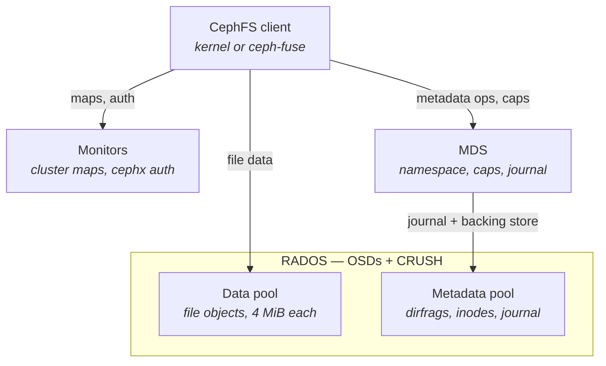
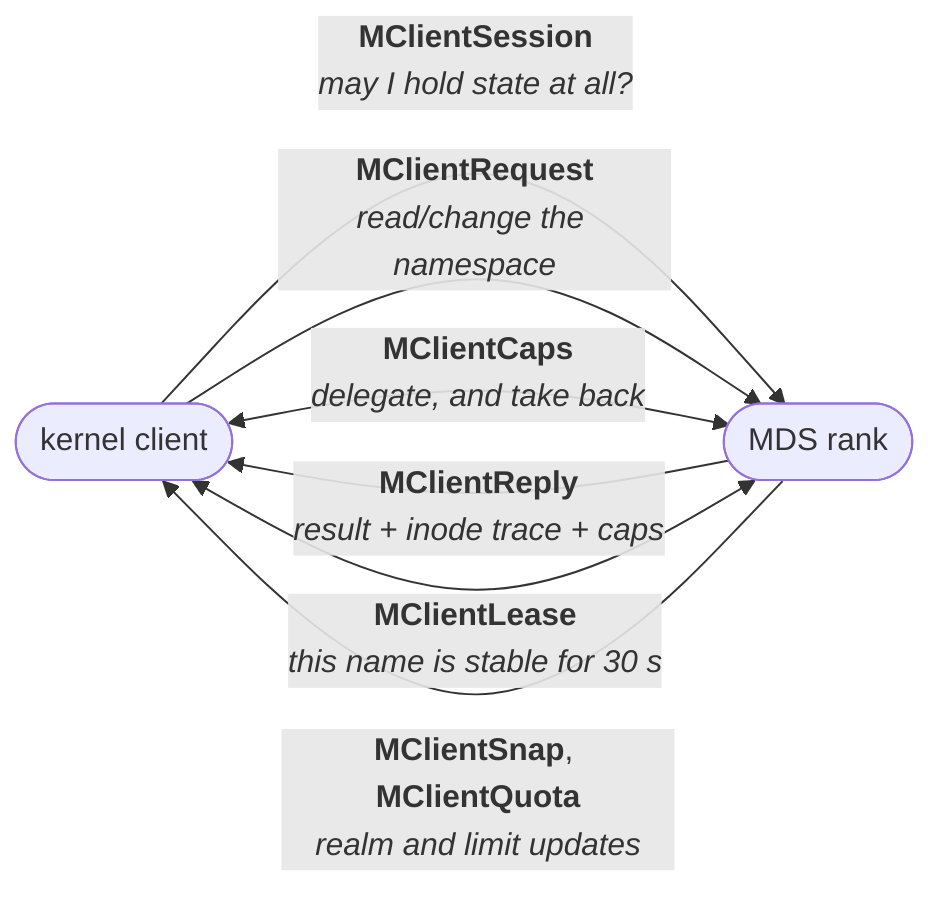
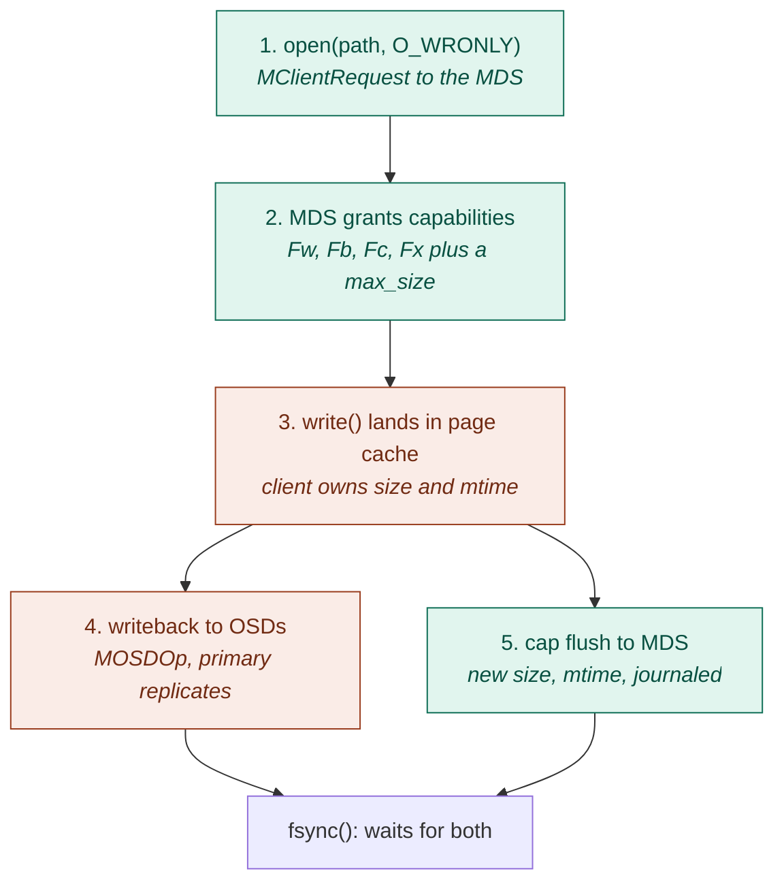

* TOC
{:toc}

CephFS is a POSIX filesystem layered on top of RADOS, with one design decision that drives
everything else: **metadata goes through the MDS, file data does not**. Clients talk to OSDs
directly for bytes.

# 1. Component architecture



**MDS (metadata server).** Holds an in-memory cache of inodes, dentries and dirfrags
(`CInode`, `CDentry`, `CDir`), and is the arbiter of who may cache what. It is not a storage
server — everything it owns is persisted into the metadata pool. Writes go first to a journal: a
chain of sequential RADOS objects in the metadata pool, named `<0x200 + rank>.<objno>` (the log
inode is `MDS_INO_LOG_OFFSET + rank`), so rank 0 gets `200.00000000` for the header and
`200.00000001` onward for payload. It is a chain, not a stripe set — the default log layout keeps
`stripe_count = 1`. Dirty metadata is later flushed to backing objects: a directory fragment
becomes one object whose omap keys are the dentries. Each file also carries its *backtrace* in an
xattr literally named `parent`, on the file's first data object in the **data** pool, so the path
can be reconstructed during disaster recovery.

With multiple active MDS ranks, the namespace is split by **dynamic subtree partitioning** — each
rank owns a set of subtrees, and hot subtrees are exported between ranks at runtime.

**Data layout.** A file's contents are striped over objects named
`<inode-hex>.<object-number-hex>`, the second field zero-padded to 8 digits (`"%llx.%08llx"`),
default `stripe_unit = object_size = 4 MiB`, `stripe_count = 1`. So offset 13 MiB in inode
`0x10000000abc` lives in object `10000000abc.00000003` at offset 1 MiB. The client computes this
locally: object name → PG via hash, PG → OSD set via CRUSH using its cached osdmap. No per-block
metadata lookup ever happens, which is why the MDS is not on the data path.

# 2. Protocol surfaces

| Channel | Messages | Purpose |
|---|---|---|
| Client&nbsp;↔&nbsp;MON | `MMonSubscribe`, `MOSDMap`, `MMDSMap`, cephx auth | maps, keys, blocklist state |
| Client&nbsp;↔&nbsp;MDS | `MClientSession`, `MClientRequest` / `MClientReply`, `MClientCaps`, [`MClientCapRelease`](https://github.com/ceph/ceph/blob/v21.3.0/src/messages/MClientCapRelease.h#L22), `MClientLease`, `MClientSnap`, `MClientReconnect` | lookup, open, create, rename, readdir, cap grant/revoke/flush |
| Client&nbsp;↔&nbsp;OSD | `MOSDOp` / [`MOSDOpReply`](https://github.com/ceph/ceph/blob/v21.3.0/src/messages/MOSDOpReply.h#L36) | read, sparse-read, write, truncate, per-object atomic transactions |
| MDS&nbsp;↔&nbsp;MDS | `MExportDir*`, `MMDSPeerRequest`, `MDentryLink/Unlink` | subtree migration, multi-rank ops such as cross-rank rename |
| MDS&nbsp;↔&nbsp;OSD | [`MOSDOp`](https://github.com/ceph/ceph/blob/v21.3.0/src/messages/MOSDOp.h#L41) | journal append, dirfrag flush, inode backtrace, data-pool truncate |

The next two subsections take the two client-facing rows apart, message by
message: what each one exists for, when it goes on the wire, what it carries,
and what each side does with it. Everything shown is decoded from a live
cluster.

Every structure and function named below links to its definition, pinned so the
line numbers stay true: userspace to [ceph
v21.3.0](https://github.com/ceph/ceph/tree/v21.3.0), kernel client to [linux
v7.2](https://github.com/torvalds/linux/tree/v7.2). The lab runs a build a
little ahead of both, so a line may have drifted by the time you read this — the
symbol names have not.

## 2.1 Watching the wire

A kernel CephFS client funnels every message through four choke points, so the
`cli.*` lane of the traces below — both directions, every message type — needs
only four probes:

| Probe | Catches |
|---|---|
| [`kfunc:libceph:ceph_con_send`](https://github.com/torvalds/linux/blob/v7.2/net/ceph/messenger.c#L1732) | everything the client sends, filtered to its MDS connection |
| [`kfunc:ceph:mds_dispatch`](https://github.com/torvalds/linux/blob/v7.2/fs/ceph/mds_client.c#L7126) | everything the MDS sends the client |
| [`kfunc:libceph:send_request`](https://github.com/torvalds/linux/blob/v7.2/net/ceph/osd_client.c#L2316) | the client's OSD ops |
| [`kfunc:libceph:__complete_request`](https://github.com/torvalds/linux/blob/v7.2/net/ceph/osd_client.c#L2518) | their replies |

Two context lanes ride along, and they are the rest of the script: a `posix`
lane of syscall tracepoints filtered to paths under the mount, so each message
can be pinned to the call that caused it, and a deliberately thin `mds` lane of
uprobes (`Server`, `Locker`, `MDLog`, `Objecter`) showing what the server did
between a request and its reply. The MDS internals behind that lane —
journaling, and the BlueStore commit every [`Objecter::_op_submit`](https://github.com/ceph/ceph/blob/v21.3.0/src/osdc/Objecter.cc#L2566) turns into —
are dissected in §3.2 of
[BlueStore I/O Path Analysis]({{ site.baseurl }}/storage/bluestore-io-analysis).

The first two decode `msg->front.iov_base` with the very struct the peer will
decode it with, so the trace's `detail` column *is* the message's fields:

```c
kfunc:ceph:mds_dispatch
{
  $m = args.msg; $t = $m->hdr.type;
  if ($t == 784) {                                 /* CEPH_MSG_CLIENT_CAPS */
    $c = (struct ceph_mds_caps *)$m->front.iov_base;
    ...   /* op, ino, seq, caps, wanted, size/max_size, truncate_seq */
```

Cap bitmasks are rendered the way [`ccap_string()`](https://github.com/ceph/ceph/blob/v21.3.0/src/mds/mdstypes.h#L103) renders them — three map
lookups for the `A`/`L`/`X` groups plus eight bit tests for the `F` group — so
`caps=pAsxLsXsxFsxcrwb` in the trace is the same string the MDS logs. The whole
script is [`fsproto.bt`]({{ site.baseurl }}/code/ceph/fsproto.bt), with
[`fsprun.py`]({{ site.baseurl }}/code/ceph/fsprun.py) to resolve the MDS
uprobes to addresses on an optimized build and
[`fsfold.py`]({{ site.baseurl }}/code/ceph/fsfold.py) to narrow the output for
publication;
[`fsprotocollect.sh`]({{ site.baseurl }}/code/ceph/fsprotocollect.sh) builds the
lab and collects every trace quoted below. Two notes for anyone re-running it:

- The probes are `kfunc`, not `kprobe`, because `fs/ceph` and `libceph` are
  modules and only `kfunc` reads their types from module BTF; and
  [`ceph_osd_req_op`](https://github.com/torvalds/linux/blob/v7.2/include/linux/ceph/osd_client.h#L140) hides the extent fields in an anonymous union bpftrace
  cannot walk, so the script mirrors that struct's prefix in its own
  declaration. Both are explained where they bite, in the script's header.
- Recent kernels also carry real tracepoints under
  `/sys/kernel/tracing/events/ceph/` — [`ceph_mdsc_submit_request`](https://github.com/torvalds/linux/blob/v7.2/fs/ceph/mds_client.c#L3845),
  [`ceph_mdsc_send_request`](https://github.com/torvalds/linux/blob/v7.2/include/trace/events/ceph.h#L138), [`ceph_mdsc_complete_request`](https://github.com/torvalds/linux/blob/v7.2/include/trace/events/ceph.h#L162), `ceph_handle_caps`.
  They need no casts and no BTF, and they are the right tool if the op code and
  tid are all you want. They cannot do the job below: [`ceph_handle_caps`](https://github.com/torvalds/linux/blob/v7.2/fs/ceph/caps.c#L4351) carries
  `mds/op/vino/seq/mseq/issue_seq` and **not** `caps`, `wanted`, `dirty`,
  `size` or `truncate_seq` — which is most of what §2.2.3 and §2.3.5 are about —
  and nothing traces what the client *sends*, or any OSD op at all.

The cluster: vstart on one Fedora 42 VM, kernel 7.2, ceph 21.3.0
(`11c38370dd1`, RelWithDebInfo) — 1 mon, 1 mgr, **2 OSDs on real block
devices** (`/dev/sda`, HDD, = `osd.0`; `/dev/nvme0n1`, SSD, = `osd.1`), 1 MDS,
all pools `size=2 min_size=1`. Pool 2 is `cephfs.a.meta`, pool 3 is
`cephfs.a.data`. Two kernel mounts with **two different cephx identities**, so
they are two independent clients with two independent sessions:
`/mnt/cephfs` (`client.admin`, global id 4168 throughout) and `/mnt/cephfs2`
(`client.two`, whose id changes on every remount — 4169, 4186, 4187 and 4240
across the traces below). One host means one monotonic clock, so client, MDS and
OSD events sort onto a single timeline with no correlation machinery.

Read the shapes, not the microseconds: `osd.0` is an emulated spinning disk, so
a commit there costs ~20 ms.

## 2.2 Client ↔ MDS

Five message families, each answering a different question:



Two facts shape everything below. First, only [`MClientRequest`](https://github.com/ceph/ceph/blob/v21.3.0/src/messages/MClientRequest.h#L89) is a *request*
in the RPC sense — everything else is one-way notification, sometimes acked.
Second, the MDS is the only party that ever initiates a [`MClientCaps`](https://github.com/ceph/ceph/blob/v21.3.0/src/messages/MClientCaps.h#L23) grant or
revoke; the client can only ask, by setting `wanted`.

### 2.2.1 [`MClientSession`](https://github.com/ceph/ceph/blob/v21.3.0/src/messages/MClientSession.h#L23) — the right to hold anything

**Why.** Caps and leases are state the MDS remembers *per client*. A session is
the container for that state, and the thing that expires when a client dies —
which is what makes the delegation safe rather than merely cooperative.

**When.** Mount, unmount, periodically while idle (`RENEWCAPS`, every
`m_session_timeout >> 2` — a quarter of the session timeout,
[`mds_client.c:6211`](https://github.com/torvalds/linux/blob/v7.2/fs/ceph/mds_client.c#L6211)), and whenever the MDS wants something from the client as a
whole (`RECALL_STATE`, `FORCE_RO`, `STALE`).

**On the wire.** [`struct ceph_mds_session_head`](https://github.com/ceph/ceph/blob/v21.3.0/src/include/ceph_fs.h#L379) is five fields — `op`, `seq`,
`stamp`, `max_caps`, `max_leases` — plus, on newer versions, the client's
metadata map on `REQUEST_OPEN` and the MDS's cap-auth list on `OPEN`. The `op`
space is a set of paired requests and answers:

| Client → MDS | MDS → Client | Meaning |
|---|---|---|
| `REQUEST_OPEN` | `OPEN` / `REJECT` | establish a session; `REJECT` means "stop contacting me" |
| `REQUEST_CLOSE` | `CLOSE` | clean unmount |
| `REQUEST_RENEWCAPS` | `RENEWCAPS` | the keepalive that stops the session going `STALE` |
| `REQUEST_FLUSH_MDLOG` | — | "make your journal durable now" — an `fsync` primitive |
| — | `STALE` | your caps are no longer valid; stop using them |
| — | `RECALL_STATE` | you hold too many caps; give some back (`max_caps`) |
| `FLUSHMSG_ACK` | `FLUSHMSG` | the one pair the MDS initiates: "acknowledge everything I have sent you so far" |
| — | `FORCE_RO` | go read-only (the filesystem was marked down) |

**Who does what.** Open and close are *journaled*: the MDS records the session
in its `SessionMap`, so a restarted rank knows who was holding what. That is
why they are not instant.

```
  #      us lane     thread       message                       detail
  3    7801 cli.4169 umount       C->MDS client_session         request_flush_mdlog seq=1
  4    7845 cli.4169 umount       C->MDS client_session         request_close seq=1
  5    8025 mds      ms_dispatch  Server::handle_client_session
  7    8059 mds      ms_dispatch  MDLog::_submit_entry          queued
  8    8375 mds      mds-log-subm Objecter::_op_submit          obj=200.00000001 pool=2
  9    8407 mds      mds-log-subm Objecter::_op_submit          obj=200.00000000 pool=2
 10   21677 cli.4169 kworker/1:3  MDS->C client_session         close seq=0
 13 2031879 cli.4186 kworker/11:0 C->MDS client_session         request_open seq=0
 15 2032784 mds      ms_dispatch  MDLog::_submit_entry          queued
 16 2032837 mds      mds-log-subm Objecter::_op_submit          obj=200.00000001 pool=2
 17 2045781 cli.4186 kworker/1:3  MDS->C client_session         open seq=0
 18 2045789 cli.4186 kworker/1:3  C->MDS client_request         tid=1 op=getattr / releases=0
```

Unmount costs 14 ms and a mount 14 ms, and in both cases the cost is a
metadata-pool journal flush — the entry object and, on the unmount, the header
too — not the message. Note the client id changes across
the remount (4169 → 4186): a session is not resumable, it is replaced. The
first thing the new session does is `getattr` on the root inode — a mount is a
session plus one `stat` of `/`.

### 2.2.2 `MClientRequest` / [`MClientReply`](https://github.com/ceph/ceph/blob/v21.3.0/src/messages/MClientReply.h#L343) — the namespace RPC

**Why.** Every POSIX operation that touches names, or attributes the client has
no cap for, is one of these. This is the only place the MDS mutates the
namespace.

**When.** `lookup`, `getattr`, `open`, `create`, `mkdir`, `unlink`, `rename`,
`readdir`, `setattr`, `setxattr`, `setfilelock`, `mksnap`… — 40-odd op codes in
`ceph_fs.h`. The encoding is a hint: `op & 0x001000` marks a write op. (The
header also documents `& 0x010000` as "follow symlink", but no op in the current
enum sets it.)

**On the wire.** [`struct ceph_mds_request_head`](https://github.com/ceph/ceph/blob/v21.3.0/src/include/ceph_fs.h#L667) then five variable pieces:

```
 ceph_mds_request_head          version, oldest_client_tid, mdsmap_epoch,
                                flags, num_retry, num_fwd, num_releases, op,
                                caller_uid/gid, ino, union args[op],
                                ext_num_retry, ext_num_fwd, owner_uid/gid
 path, path2                    filepath = (base ino, string) x2
 releases[num_releases]         cap and dentry-lease releases, piggybacked
 stamp, gid_list                client clock, supplementary groups
 alternate_name, fscrypt_*      encrypted-name support
```

Three details carry real weight. **`union args`** is why one message type covers
40 operations: `args.open` holds flags/mode/layout/`mask`, `args.setattr` holds
mode/uid/gid/mtime/size/`mask`, `args.readdir` holds frag/`max_entries`/
`max_bytes`. **`filepath` is (base ino, string)**, not an absolute path — the client resolves
what it can and names a base inode plus the rest, usually the parent plus one
component; the MDS log renders it `#0x1/dbgf`. And **`releases`** lets a request return caps
and leases the client no longer wants, in the same message that asks for
something new: the `releases=1` in the traces below is one dentry lease going
home.

**The reply.** [`struct ceph_mds_reply_head`](https://github.com/ceph/ceph/blob/v21.3.0/src/include/ceph_fs.h#L718) is `op`, `result`, `mdsmap_epoch`,
and three flags — `safe`, `is_dentry`, `is_target` — followed by three
length-prefixed blobs: the **trace**, the **extra** payload, and the
**snapblob**. The trace is the whole point:

```
 trace = [ if is_dentry:  diri (InodeStat) + dirfrag + dname + dlease ]
         [ if is_target:  targeti (InodeStat) ]
```

An [`InodeStat`](https://github.com/ceph/ceph/blob/v21.3.0/src/messages/MClientReply.h#L118) (`struct ceph_mds_reply_inode`) is a complete stat buffer —
ino, version, layout, ctime/mtime/atime, size/`max_size`/`truncate_size`/
`truncate_seq`, mode/uid/gid/nlink, dir rstats, fragtree — **plus an embedded
[`ceph_mds_reply_cap`](https://github.com/ceph/ceph/blob/v21.3.0/src/include/ceph_fs.h#L741)**: `caps`, `wanted`, `cap_id`, `seq`, `mseq`, `realm`.
So one reply populates the client's dcache, its inode cache, its cap state and
its dentry lease at once. [`parse_reply_info_extra()`](https://github.com/torvalds/linux/blob/v7.2/fs/ceph/mds_client.c#L771) handles the per-op tail:
the dentry list for `readdir`, the created-inode info for `create`, the lock
state for `getfilelock`.

**Who does what.** [`Server::handle_client_request()`](https://github.com/ceph/ceph/blob/v21.3.0/src/mds/Server.cc#L2605) ([`Server.cc:2605`](https://github.com/ceph/ceph/blob/v21.3.0/src/mds/Server.cc#L2605)):

```
  session open?  ──no──► drop the message (no reply)
        │yes
  retry of a completed request?  ──yes──► re-send the stored reply, done
        │no
  mdcache->request_start()  ──►  an MDRequestImpl, tracked in the session
        │
  process head.releases  ──►  Locker::process_request_cap_release()
        │
  dispatch_client_request()  ──►  take locks, project the change
        │                          into the cache
        └──► journal_and_reply()  ──►  early_reply()   the reply goes out
                     │                                 HERE, unsafe
                     └──► MDLog::_submit_entry()  ──► ... later ... ──►
                          reply_client_request()   the SAFE reply
```

The reply leaves **before** the journal entry is durable:

```
  5    1936 cli.4168 dd           C->MDS client_request         tid=51 op=create /f16k releases=0
  6    2405 mds      ms_dispatch  Server::handle_client_request op=create
 11    3231 mds      ms_dispatch  Server::early_reply           unsafe reply
 13    3269 mds      ms_dispatch  MDLog::_submit_entry          queued
 14    3567 cli.4168 kworker/1:1  MDS->C client_reply           tid=51 op=create result=0 unsafe trace=[dentry
                                                                 target]
```

1.6 ms, one round trip, and the file exists as far as `openat` is concerned —
but the reply says `unsafe`, and [`MDLog::_submit_entry`](https://github.com/ceph/ceph/blob/v21.3.0/src/mds/MDLog.cc#L393) only *queued* the
journal entry. Nothing was written to RADOS. The client must remember the
request until a second reply says `SAFE`, and be able to replay it if the rank
dies. How lazy that is depends entirely on whether anyone asks; `rename` and
`unlink` show the extreme:

```
  9    6590 cli.4168 mv           C->MDS client_request         tid=35 op=rename /f5r releases=1
 12    6911 mds      ms_dispatch  Server::early_reply           unsafe reply
 15    7145 cli.4168 kworker/5:3  MDS->C client_reply           tid=35 op=rename result=0 unsafe trace=[dentry
                                                                 target]
 20 1010814 cli.4168 rm           C->MDS client_request         tid=36 op=unlink /f4 releases=1
 23 1011420 mds      ms_dispatch  Server::early_reply           unsafe reply
 29 1767090 mds      safe_timer   Objecter::_op_submit          obj=200.00000001 pool=2
 31 1791553 mds      mds-rank-fin Server::reply_client_request  reply
 36 1791662 cli.4168 kworker/7:1  MDS->C client_reply           tid=35 op=rename result=0 SAFE trace=[]
```

`renameat2` completed on the unsafe reply, 1.4 ms after it was issued. The
journal write that makes it durable left the MDS at 1.77 **seconds**, on a
periodic timer, and carried both the rename and the unlink. That is the MDS's amortization: replies decouple from durability, and
one RADOS write pays for many updates.

Read ops skip all of it — no journal, no early reply, one `SAFE` reply:

```
 23 3049248 cli.4186 stat         C->MDS client_request         tid=2 op=lookup /d1 releases=0
 25 3049724 mds      ms_dispatch  Server::reply_client_request  reply
 26 3049737 mds      ms_dispatch  Locker::issue_client_lease    dentry lease into reply
 27 3049911 cli.4186 kworker/1:3  MDS->C client_reply           tid=2 op=lookup result=0 SAFE trace=[dentry
                                                                 target]
 28 3050039 cli.4186 stat         C->MDS client_request         tid=3 op=lookup /f3 releases=0
 29 3050240 mds      ms_dispatch  Server::handle_client_request op=lookup
 31 3050273 mds      ms_dispatch  Locker::issue_client_lease    dentry lease into reply
 32 3050307 cli.4186 kworker/6:0  MDS->C client_reply           tid=3 op=lookup result=0 SAFE trace=[dentry
                                                                 target]
```

One `lookup` per path component — 663 µs for `d1`, 268 µs for `f3` — each
returning a dentry lease and an `InodeStat`. Repeat the same `stat` a second later and the
trace is **empty**: the leases and the `Fs` cap answer it locally. That gap is
the protocol working.

[`MClientRequestForward`](https://github.com/ceph/ceph/blob/v21.3.0/src/messages/MClientRequestForward.h#L22) completes the picture on a multi-rank filesystem: if the
inode is not on this rank, the MDS replies with a forward instead of a result,
and the client re-sends to the named rank, bumping `num_fwd`.

### 2.2.3 `MClientCaps` — the delegation, and taking it back

**Why.** A `stat`-heavy or write-heavy workload cannot round-trip to the MDS per
operation. Caps let the client answer locally: hold `Fs` and you own the cached
size and mtime; hold `Fb` and you may buffer writes; hold `Fc` and you may serve
reads from the page cache. `MClientCaps` is how that authority moves.

**When.** Constantly, and in both directions. Grants ride replies where they
can; a standalone `MClientCaps` is sent whenever the MDS changes its mind
(`GRANT`, `REVOKE`, `TRUNC`, `EXPORT`, `IMPORT`) or the client has something to
report (`UPDATE`, `FLUSH`, `FLUSHSNAP`), plus the two acks (`FLUSH_ACK`,
`FLUSHSNAP_ACK`).

**On the wire.** [`struct ceph_mds_caps_head`](https://github.com/ceph/ceph/blob/v21.3.0/src/include/ceph_fs.h#L926) + a body. The head carries the
identity and the three bitmasks; the body carries the fields the bitmasks
license:

| Field | Direction it matters | Meaning |
|---|---|---|
| `op` | both | one of 13 `CEPH_CAP_OP_*`; the client sends only three of them |
| `ino`, `cap_id`, `realm` | both | which inode, which cap instance, which snap realm |
| `seq`, `issue_seq`, `migrate_seq` | both | grant serialization; `mseq` survives cap export between ranks |
| `caps` | both | MDS→client: what you now hold. client→MDS: what I still hold |
| `wanted` | client→MDS mostly | what the client would like — the *only* input it has |
| `dirty` | client→MDS | which fields this message is flushing |
| `size`, `max_size`, `truncate_size/seq`, `mtime/atime/ctime`, `time_warp_seq`, `layout` | both | the filelock body |
| `uid/gid/mode`, `nlink`, `xattr_*` | both | the auth-, link- and xattr-lock bodies |
| `snap_follows`, `snap_trace_len` | both | which snapshot this flush belongs to |
| *(osd epoch barrier, v5+)* | both | "do not touch RADOS until you have seen epoch N" |

That last one is the safety interlock: after a blocklist, the MDS stamps a
barrier into cap messages so a client cannot keep writing with a stale osdmap.
[`ceph_osdc_update_epoch_barrier()`](https://github.com/torvalds/linux/blob/v7.2/net/ceph/osd_client.c#L2627) on the client side stalls its Objecter until
it catches up.

**Who does what — MDS.** [`Locker::issue_caps()`](https://github.com/ceph/ceph/blob/v21.3.0/src/mds/Locker.cc#L2573) ([`Locker.cc:2573`](https://github.com/ceph/ceph/blob/v21.3.0/src/mds/Locker.cc#L2573)) walks the
inode's `client_caps` map and, **for each client independently**, computes

```
  allowed = get_allowed_caps(inode, cap)       /* from the lock-state table */
  new     = (wanted | likes) & allowed         /* and & pending, if revoking */
  op      = (pending & ~new) ? REVOKE : GRANT
```

No client's mask is compared against another's — [`get_allowed_caps()`](https://github.com/ceph/ceph/blob/v21.3.0/src/mds/Locker.h#L189) reads only
the lock state and whether *this* client is the inode's loner
([`Locker.cc:2522`](https://github.com/ceph/ceph/blob/v21.3.0/src/mds/Locker.cc#L2522)), and choosing the loner is the one place clients are weighed
against each other. §6 has why exclusivity is emergent rather than enforced. The important consequence for the wire: each *lock*
transition triggers its own `issue_caps()` pass, so one conflicting open
produces a *staircase* of revokes rather than one. Two clients, one file —
abridged to the events the ladder below cannot carry, the gaps in the `#`
column being the elisions:

```
 42 1064015 posix    cat          openat(2)                     /mnt/cephfs2/shared flags=00
 43 1064038 cli.4187 cat          C->MDS client_request         tid=18 op=open /shared releases=0
 46 1065317 cli.4168 kworker/1:1  MDS->C client_caps            revoke ino=0x10000000201 seq=11
                                                                 caps=pAsLsXsxFsxcrwb wanted=pAsxXsxFxwb
                                                                 size=0/4194304 tseq=4
 47 1065328 cli.4168 kworker/1:1  C->MDS client_caps            update ino=0x10000000201 seq=11
                                                                 caps=pAsLsXsxFsxcrwb dirty=Fw
                                                                 wanted=pAsxXsxFxwb size=16384
 54 1066179 cli.4168 kworker/11:0 MDS->C client_caps            revoke ino=0x10000000201 seq=12
                                                                 caps=pAsLsXsFsxcrwb wanted=pAsxXsxFxwb
                                                                 size=16384/4194304 tseq=4
 55 1066194 cli.4168 kworker/11:0 C->MDS client_caps            update ino=0x10000000201 seq=12
                                                                 caps=pAsLsXsFsxcrwb dirty=- wanted=pAsxXsxFxwb
                                                                 size=16384
 66 1067230 cli.4168 kworker/1:1  MDS->C client_caps            revoke ino=0x10000000201 seq=13 caps=pAsLsXsFrw
                                                                 wanted=pAsxXsxFxwb size=16384/4194304 tseq=4
 68 1067579 cli.4168 kworker/u49: C->OSD osd_op                 tid=29 10000000201.00000000 pool=3 pg=3.68
                                                                 (hash b46e5ee8) -> osd0 [write 0~16384
                                                                 tseq=4/0] WRITE|ONDISK ops=1 try=0
 74 1094341 cli.4168 kworker/7:0  OSD->C osd_op_reply           tid=29 result=0 [write rval=0 outdata=0]
 75 1094365 cli.4168 kworker/7:0  C->MDS client_caps            update ino=0x10000000201 seq=13 caps=pAsLsXsFrw
                                                                 dirty=- wanted=pAsxXsxFxwb size=16384
 83 1095199 cli.4168 kworker/1:1  MDS->C client_caps            revoke ino=0x10000000201 seq=14 caps=pAsLsXsFr
                                                                 wanted=pAsxXsxFxwb size=16384/4194304 tseq=4
 84 1095203 cli.4168 kworker/1:1  C->MDS client_caps            update ino=0x10000000201 seq=14 caps=pAsLsXsFr
                                                                 dirty=- wanted=pAsxXsxFxwb size=16384
 85 1095494 cli.4187 kworker/8:3  MDS->C client_caps            grant ino=0x10000000201 seq=3 caps=pAsLsXsFr
                                                                 wanted=pFscr size=16384/0 tseq=4
```

The whole exchange, drawn as the ladder it is:

```
   client 4168 (buffering)              MDS                        client 4187
   pAsxLsXsxFsxcrwb                      │                       open("shared") ──►
        │                                │ iauth  excl -> sync         │
        │ ◄─── revoke  pAsLsXsxFsxcrwb ──┤        (Ax gone)            │
        ├──── update   dirty=Fw ─────────►   size=16384 journaled      │
        │                                │ ixattr excl -> sync         │
        │ ◄─── revoke  pAsLsXsFsxcrwb ───┤        (Xx gone)            │
        ├──── update   dirty=-  ─────────►                             │
        │                                │ ifile  excl -> mix          │
        │ ◄─── revoke  pAsLsXsFrw ───────┤        (Fsxcb gone: caching)│
        │                                │                             │
   writeback ──── MOSDOp write 0~16384 ──────────────► osd.0           │
        │ ◄────────────────── reply, 27 ms ───────────┘                │
        ├──── update   caps=pAsLsXsFrw ──►   "cache is clean"          │
        │                                │ ifile  mix -> sync          │
        │ ◄─── revoke  pAsLsXsFr ────────┤        (Fw gone)            │
        ├──── update   ──────────────────►                             │
        │                                ├──── grant pAsLsXsFr ───────►│
   both synchronous: every read goes to the OSDs
```

The four lock transitions in the middle column are not guesswork. Re-run the
same workload with `debug_mds 20` and they appear in the MDS's own inode dump,
in that order (a different inode, same two clients, same cap strings). The third
line also carries `iauth sync->excl`, the auth lock bouncing back because 4168
still wants `Asx` — churn the cap ladder does not show, since it costs no
message:

```
(iauth excl->sync) (ifile excl) (ixattr excl)     ...  caps={4168=pAsLsXsxFsxcrwb/...}
(iauth sync r=1) (ifile excl w=1) (ixattr excl->sync)
(iauth sync->excl r=1) (ifile excl->mix w=1) (ixattr sync r=1)
(ifile mix->sync)                                ...  caps={4168=pAsLsXsFr/...,4187=...}
```

Four revokes, four acks, one 27 ms writeback in the middle. The first `update`
is the interesting one: `dirty=Fw size=16384` is the size the MDS did not know,
travelling home *because* the cap was taken away. The MDS does not wait for a
timeout — it waits for that ack, and cannot proceed without it (§6 covers what
happens when it never comes).

**Who does what — client.** `ceph_handle_caps()` (`fs/ceph/caps.c`) dispatches
on `op`, and the first thing to notice is that `GRANT` and `REVOKE` land in the
**same function**, [`handle_cap_grant()`](https://github.com/torvalds/linux/blob/v7.2/fs/ceph/caps.c#L3501). The op is only a hint; what the client
acts on is the diff between the new `caps` mask and what it holds:

```
  Fb gone     ──►  write back dirty pages first -- "initiate writeback;
                   will delay ack" (caps.c), which is why the ack in the
                   trace above lands 27 ms later
  Fc gone     ──►  invalidate the page cache
  Fs gone     ──►  the client can no longer answer a stat locally:
                   CEPH_STAT_CAP_SIZE and _MTIME are both CEPH_CAP_FILE_SHARED,
                   so the next stat becomes a getattr to the MDS.  (The message's
                   own size/mtime are applied on a different test entirely --
                   ceph_fill_file_size() on truncate_seq, ceph_fill_file_time()
                   guarded by whichever excl bits are still in `issued`.)
      └───────►  then ack: UPDATE, or FLUSH if metadata is dirty
```

`TRUNC` gets its own handler (`handle_cap_trunc`), and
`EXPORT`/`IMPORT` are the cap moving between MDS ranks during subtree
migration.

Outbound, the client only ever sends three ops: `UPDATE` (acking, or reporting
a changed `wanted`), `FLUSH` (dirty fields, with a `tid` the ack matches), and
`FLUSHSNAP`. There is no "revoke" direction.

**`MClientCapRelease`** is the other half of giving caps back — a batched,
fire-and-forget list of `(ino, cap_id, migrate_seq, issue_seq)` for caps the
client has dropped entirely, typically because the kernel reclaimed the inode.
It costs one message for many inodes and needs no reply:

```
 25 5387312 cli.4168 kworker/2:3  C->MDS client_cap_release     num=1
 27 5387756 mds      ms_dispatch  Locker::issue_caps            recompute + send grants
```

### 2.2.4 [`MClientLease`](https://github.com/ceph/ceph/blob/v21.3.0/src/messages/MClientLease.h#L24) — names, on their own

**Why.** A cap covers an *inode*. `lookup` results are about a *name*, including
names that do not exist. A lease on a dentry is what lets a client answer a
repeated `stat` — or a repeated `ENOENT` — without the MDS.

**When.** Leases are normally *issued inside a reply* — that is what
[`Locker::issue_client_lease`](https://github.com/ceph/ceph/blob/v21.3.0/src/mds/Locker.cc#L4526) is doing in the traces above. A
[`ceph_mds_reply_lease`](https://github.com/ceph/ceph/blob/v21.3.0/src/include/ceph_fs.h#L753) rides the reply's **trace** blob for a lookup, and its
**extra** blob for a readdir, one per entry (`parse_reply_info_readdir`). A standalone `MClientLease`
is only sent for the exceptions: the MDS revoking one early, the client acking
that revoke, and a renewal.

**On the wire.** [`struct ceph_mds_lease`](https://github.com/ceph/ceph/blob/v21.3.0/src/include/ceph_fs.h#L981) is `action`, `mask`, `ino`, snap range,
`seq`, `duration_ms`, plus the dentry name. Four actions:

| Action | Direction |
|---|---|
| `REVOKE` | MDS → client |
| `RELEASE` | client → MDS |
| `RENEW` | either |
| `REVOKE_ACK` | client → MDS |

**Who does what.** Unlike a cap, a lease has a **fixed duration** — 30 s here —
so it lapses on its own if nothing renews it. The MDS still tracks it
(`dn->add_client_lease(session)` plus a per-pool expiry list in the MDCache) and
can revoke early. No lease is issued at all when the client already holds
`Fs`/`Fx` on the parent directory, because the directory caps already cover the
name. Of the four actions the kernel client sends only two — `RENEW` and
`REVOKE_ACK`; `RELEASE` exists in the protocol but the kernel drops leases
silently instead. The create trace
shows both halves of a revoke:

```
  7    2461 mds      ms_dispatch  Locker::revoke_client_leases
  8    2747 cli.4168 kworker/1:1  MDS->C client_lease           revoke ino=0x1 seq=32 dur=0ms
  9    2751 cli.4168 kworker/1:1  C->MDS client_lease           revoke_ack ino=0x1 seq=32
```

`ino=0x1` is the **parent**, not the subject: [`Locker::revoke_client_leases()`](https://github.com/ceph/ceph/blob/v21.3.0/src/mds/Locker.cc#L4576)
builds the message from `diri->ino()` plus `dn->get_name()`, and the kernel does
the same (`lease->ino = ceph_ino(dir)`). What is revoked is the lease on the
*name* being created inside `/`. 4 µs to ack, and only then does the create
proceed. (The tracer prints only the ino, never the dname, so which name it is
has to come from the workload.) A renewal is one message each way — here on the
name `d1`, while `ls` revalidates the path:

```
  2    4361 cli.4186 ls           C->MDS client_lease           renew ino=0x1 seq=2
  6    5014 cli.4186 kworker/6:0  MDS->C client_lease           renew ino=0x1 seq=3 dur=30000ms
```

`readdir` is where leases pay off most: the MDS issues one *per entry*, inside
the single reply.

```
 16    5909 cli.4186 ls           C->MDS client_request         tid=5 op=readdir /d1 releases=1
 18    6052 mds      ms_dispatch  Locker::issue_client_lease    dentry lease into reply
 19    6060 mds      ms_dispatch  Locker::issue_client_lease    dentry lease into reply
 20    6063 mds      ms_dispatch  Locker::issue_client_lease    dentry lease into reply
 21    6065 mds      ms_dispatch  Locker::issue_client_lease    dentry lease into reply
 22    6067 mds      ms_dispatch  Locker::issue_client_lease    dentry lease into reply
 23    6072 mds      ms_dispatch  Server::reply_client_request  reply
```

Five files, five leases, **one** message. A subsequent `stat` of any of them
costs nothing; and if the client reads every entry it may set the directory's
"complete" flag and serve the whole `readdir` locally next time.

### 2.2.5 The remaining three

**[`MClientSnap`](https://github.com/ceph/ceph/blob/v21.3.0/src/messages/MClientSnap.h#L21)** (MDS → client) keeps the client's snap-realm tree in step:
`op` is `UPDATE`/`CREATE`/`DESTROY`/`SPLIT`, plus a `split` inode, the inodes
and realms moving into a new child realm, and a trace blob of
[`ceph_mds_snap_realm`](https://github.com/ceph/ceph/blob/v21.3.0/src/include/ceph_fs.h#L1043) records. The client needs this because it, not the MDS,
attaches the right `snapc` to every data write — a write into a snapshotted
subtree must carry the snap context the OSD uses to decide whether to clone.

**[`MClientQuota`](https://github.com/ceph/ceph/blob/v21.3.0/src/messages/MClientQuota.h#L7)** (MDS → client) pushes an inode's `rstat` and `quota`
(`max_bytes`, `max_files`) so the client can return `EDQUOT` locally instead of
discovering the limit at writeback time.

**[`MClientReconnect`](https://github.com/ceph/ceph/blob/v21.3.0/src/messages/MClientReconnect.h#L24)** (client → MDS) is the recovery message: after a rank
restarts, each client sends its whole held state — one
[`ceph_mds_cap_reconnect`](https://github.com/ceph/ceph/blob/v21.3.0/src/include/ceph_fs.h#L992) per cap (`cap_id`, `wanted`, `issued`, `snaprealm`,
`pathbase`, flock blob) plus its snap realms — and the new rank rebuilds its
cache from what the clients say they have, rather than flushing everything.

**[`MClientMetrics`](https://github.com/ceph/ceph/blob/v21.3.0/src/messages/MClientMetrics.h#L12)** shows up uninvited in every trace: each client ships
latency and cache counters to the MDS once a second (`metric_schedule_delayed`,
a flat `HZ`, 328 B). Pure telemetry — noted here so you know to filter it out.

### 2.2.6 One file, end to end

Everything above, in one trace: `dd` creates a file on the mount, writes 16 KiB,
and `fsync`s. The `posix` lane is the syscalls, `cli.4168` is the client's
messages, `mds` is what the server did in between.

```
  #      us lane     thread       message                       detail
  4    1909 posix    dd           openat(2)                     /mnt/cephfs/f16k flags=01101
  5    1936 cli.4168 dd           C->MDS client_request         tid=51 op=create /f16k releases=0
  6    2405 mds      ms_dispatch  Server::handle_client_request op=create
  7    2461 mds      ms_dispatch  Locker::revoke_client_leases
  8    2747 cli.4168 kworker/1:1  MDS->C client_lease           revoke ino=0x1 seq=32 dur=0ms
  9    2751 cli.4168 kworker/1:1  C->MDS client_lease           revoke_ack ino=0x1 seq=32
 10    3187 mds      ms_dispatch  Locker::issue_caps            recompute + send grants
 11    3231 mds      ms_dispatch  Server::early_reply           unsafe reply
 12    3245 mds      ms_dispatch  Locker::issue_client_lease    dentry lease into reply
 13    3269 mds      ms_dispatch  MDLog::_submit_entry          queued
 14    3567 cli.4168 kworker/1:1  MDS->C client_reply           tid=51 op=create result=0 unsafe trace=[dentry
                                                                 target]
 15    3650 posix    dd           read(2)                       fd=0 len=16384
 16    3661 posix    dd           write(2)                      fd=1 len=16384
 17    3682 posix    dd           fsync(2)                      fd=1
 18    3708 cli.4168 dd           C->OSD osd_op                 tid=28 10000000207.00000000 pool=3 pg=3.7 (hash
                                                                 f2895a87) -> osd0 [write 0~16384 tseq=1/-1]
                                                                 WRITE|ONDISK ops=1 try=0
 19   26121 cli.4168 kworker/9:0  OSD->C osd_op_reply           tid=28 result=0 [write rval=0 outdata=0]
 20   26500 cli.4168 dd           C->MDS client_caps            flush ino=0x10000000207 seq=1
                                                                 caps=pAsxLsXsxFsxcrwb dirty=Fw
                                                                 wanted=pAsxXsxFxcwb size=16384
 21   26516 cli.4168 dd           C->MDS client_session         request_flush_mdlog seq=106
 22   27264 mds      ms_dispatch  Locker::handle_client_caps
 23   27294 mds      ms_dispatch  Locker::_do_cap_update        journal size/mtime
 24   27327 mds      ms_dispatch  MDLog::_submit_entry          queued
 25   27370 mds      ms_dispatch  Server::handle_client_session
 26   27592 mds      mds-log-subm Objecter::_op_submit          obj=200.00000001 pool=2
 27   48055 mds      mds-rank-fin Server::reply_client_request  reply
 28   48092 mds      mds-rank-fin Locker::file_update_finish    journaled -> flush_ack
 29   48440 cli.4168 kworker/1:1  MDS->C client_caps            grant ino=0x10000000207 seq=2
                                                                 caps=pAsxLsXsxFsxcrwb wanted=pAsxXsxFxcwb
                                                                 size=16384/4194304 tseq=1
 30   48450 cli.4168 kworker/1:1  MDS->C client_reply           tid=51 op=create result=0 SAFE trace=[]
 31   48464 cli.4168 kworker/1:1  MDS->C client_caps            flush_ack ino=0x10000000207 seq=1
                                                                 caps=pAsxLsXsxFsxcrwb wanted=- size=0/0 tseq=0
 32   48595 posix    dd           fsync(2)                      returned, 44915 us
```

Eleven messages, and the `write(2)` is not one of them. Line 16 puts 16 KiB in
the page cache and returns: the create reply granted `Fb`, so buffering is
legal, and `Fw` plus a `max_size` lets the client extend the file to 16384
locally. That `max_size` is not visible here — this tracer does not decode the
reply's embedded cap, and the first standalone grant showing
`size=16384/4194304` is line 29, long after the write. It comes from
[`Locker::issue_new_caps()`](https://github.com/ceph/ceph/blob/v21.3.0/src/mds/Locker.cc#L2434), which ends in [`check_inode_max_size()`](https://github.com/ceph/ceph/blob/v21.3.0/src/mds/Locker.h#L204)
([`Locker.cc:2722`](https://github.com/ceph/ceph/blob/v21.3.0/src/mds/Locker.cc#L2722)). The cluster only hears about it because line 17 asks it to.

The fsync then runs two serial phases — the question the next paragraphs answer
is which of them it actually waits for:

```
   dd                         client                MDS                    OSDs
    │ create ─────────────► client_request ──────────► journal queued
    │ ◄──────────────────── client_reply(unsafe) ◄──── early_reply
    │ write(2) ───────────► page cache            (Fb: nothing on the wire)
    │ fsync ──────────────► MOSDOp write ──────────────────────────────► pool 3
    │                       ◄── ondisk reply, 22 ms ───────────────────┘
    │                       client_caps(flush, dirty=Fw, size=16384) ──►
    │                                            journal EUpdate ─────► pool 2
    │                                            ◄── ondisk, 20 ms ────┘
    │ ◄──────────────────── client_reply(SAFE) ◄─── this is what unblocks it
    │ ◄──────────────────── grant + flush_ack ◄──── these do not
    │ fsync returns, 45 ms
```

Data first, then metadata — but that order is the kernel's, not the protocol's.
[`ceph_fsync()`](https://github.com/torvalds/linux/blob/v7.2/fs/ceph/caps.c#L2480) (`fs/ceph/caps.c`) calls `file_write_and_wait_range()`, then
[`try_flush_caps()`](https://github.com/torvalds/linux/blob/v7.2/fs/ceph/caps.c#L2285), then [`flush_mdlog_and_wait_inode_unsafe_requests()`](https://github.com/torvalds/linux/blob/v7.2/fs/ceph/caps.c#L2363), in that
order. Nothing on the wire requires it: §2.2.3's trace has a new size reaching
the MDS while its bytes are still dirty, and §4 says the two are unordered.

The second commit cycle is not the size, either. fsync waits on the cap flush
only

```c
/* only wait on non-file metadata writeback (the mds can recover
   size and mtime, so we don't need to wait for that) */
if (!err && (dirty & ~CEPH_CAP_ANY_FILE_WR))
        err = wait_event_interruptible(...caps_are_flushed...);
```

and `dirty=Fw` is inside `CEPH_CAP_ANY_FILE_WR`, so that wait is skipped. What
this fsync blocks on is the **create**, still unsafe — which is also the only
reason line 21's `request_flush_mdlog` went out at all
(`flush_mdlog_and_wait_inode_unsafe_requests()` sends it only when a request on
the inode has no SAFE reply yet). fsync returns on line 30, the SAFE reply;
line 31's `flush_ack` is 14 µs later and incidental.

Take the create away and the metadata cycle leaves the critical path entirely.
This is the second half of §2.3.5's truncate run — same file, already existing,
nothing unsafe pending, 4 KiB written and fsynced:

```
 50 1024352 posix    dd           fsync(2)                      fd=1
 51 1024382 cli.4168 dd           C->OSD osd_op                 tid=30 10000000200.00000000 pool=3 pg=3.19
                                                                 (hash 62465499) -> osd1 [write 0~4096
                                                                 tseq=6/4096] WRITE|ONDISK ops=1 try=0
 52 1045559 cli.4168 kworker/3:2  OSD->C osd_op_reply           tid=30 result=0 [write rval=0 outdata=0]
 53 1045895 cli.4168 dd           C->MDS client_caps            flush ino=0x10000000200 seq=9
                                                                 caps=pAsxLsXsxFsxcrwb dirty=Fw
                                                                 wanted=pAsxXsxFxcwb size=4096
 54 1045907 posix    dd           fsync(2)                      returned, 21555 us
 58 1046709 mds      mds-log-subm Objecter::_op_submit          obj=200.00000001 pool=2
 62 1067076 cli.4168 kworker/11:0 MDS->C client_caps            flush_ack ino=0x10000000200 seq=9
                                                                 caps=pAsxLsXsxFsxcrwb wanted=- size=0/0 tseq=0
```

The cap flush leaves at 1045895 and `fsync` returns **12 µs later**. The MDS
had not even started its journal write (line 58, 1046709), and the `flush_ack`
came back at 1067076 — 21 ms after the application was already running again.

So the honest version: **an fsync on CephFS costs one data commit, plus a
second metadata commit only while some request on that inode is still unsafe.**
The new size is fire-and-forget by design, because the MDS can reconstruct it.

## 2.3 Client ↔ OSD

One message type in each direction, and no metadata server involved at all.

### 2.3.1 `MOSDOp` — what it carries

**Why.** File data must not go through the MDS, or the MDS becomes the
bottleneck for bandwidth as well as metadata. The client therefore addresses
objects directly — and to do that it needs no lookup, only arithmetic.

**When.** Whenever a read misses the page cache or `Fc` is not held, whenever
writeback runs or `Fb` is not held, and on `O_DIRECT` inside `write(2)`.

**On the wire** — grouped by purpose, not in `encode_payload`'s v9 order:

```
 MOSDOp                              what it is for
 ─────────────────────────────────── ───────────────────────────────────────
 object_locator_t oloc               which pool (and namespace)
 hobject_t hobj                      the object; CephFS names it
                                     "<ino-hex>.<block-hex>"
 spg_t pgid                          the PG the *client* computed
 __u32 osdmap_epoch                  which map that computation used
 __u32 flags                         READ | WRITE | ONDISK | ...; the tracer
                                     renders these, not the raw value
 utime_t mtime                       the write's timestamp (client's clock)
 int32_t retry_attempt               resend counter
 snapid_t snap_seq; vector snaps     the snap context (from MClientSnap)
 vector<OSDOp> ops                   1..N ops, applied atomically
 osd_reqid_t reqid                   (client, inc, tid) — the dedup key
 header.tid                          the client's op id, echoed in the reply
```

Each `OSDOp` is a [`ceph_osd_op`](https://github.com/ceph/ceph/blob/v21.3.0/src/include/rados.h#L599): a 16-bit opcode, flags, and a union. For the
extent family the union is `{offset, length, truncate_size, truncate_seq}`. The
opcode itself is structured — `mode | type | nr`, so `0x2201` is
`WR | DATA | 1` = write, `0x1201` is `RD | DATA | 1` = read — which is why the
trace can name them from a table of a dozen entries.

**The reply.** `MOSDOpReply` carries `oid`, `pgid`, the `ops` vector back with
each op's `rval` and output data, an overall `result`, `replay_version` /
`user_version`, and flags saying how durable the answer is (`ack` /
`onnvram` / `ondisk`). Every libceph request carries `ONDISK` —
[`account_request()`](https://github.com/torvalds/linux/blob/v7.2/net/ceph/osd_client.c#L2474) (`net/ceph/osd_client.c`) sets it unconditionally, reads
included — which is why the tracer prints it on everything:

```
 18    3708 cli.4168 dd           C->OSD osd_op                 tid=28 10000000207.00000000 pool=3 pg=3.7 (hash
                                                                 f2895a87) -> osd0 [write 0~16384 tseq=1/-1]
                                                                 WRITE|ONDISK ops=1 try=0
 19   26121 cli.4168 kworker/9:0  OSD->C osd_op_reply           tid=28 result=0 [write rval=0 outdata=0]
```

**Who does what.** The client's side is arithmetic, not lookup:

```
   offset 0, inode 0x10000000207, data pool 3
        │  layout: stripe_unit = object_size = 4 MiB, stripe_count = 1
        ▼
   object  10000000207.00000000                        ("%llx.%08llx")
        │  ceph_str_hash(name)
        ▼
   hash  f2895a87                       <- the "raw pg", r_t.pgid.seed
        │  ceph_stable_mod(hash, pg_num=128)
        ▼
   pg  3.7                              <- the real PG, r_t.spgid
        │  CRUSH(pgid, cached osdmap)
        ▼
   acting set  [osd.0, osd.1]  ->  primary osd.0
```

Every arrow is local, from the cached osdmap; `ceph osd map cephfs.a.data
10000000207.00000000` on the cluster returns the same `3.f2895a87 (3.7) ->
up ([0,1], p0)`. The `pg=3.7 (hash f2895a87) -> osd0` in the trace is the
client's own answer, computed before the message existed;
`osdmap_epoch` in the message lets the OSD detect that the client used a stale
map and bounce the op instead of misapplying it. On the OSD, the reply's
`ONDISK` flag is what makes the client wait for a real commit rather than for a
receipt — most of the 22 ms in line 19 is `osd.0`, an emulated spinning disk,
inside BlueStore ([§3.1 of the BlueStore I/O analysis]({{ site.baseurl }}/storage/bluestore-io-analysis)
takes that 22 ms apart).

### 2.3.2 The ops CephFS actually issues

Of the 81 RADOS ops in `rados.h`, a CephFS client uses a handful:

| Op | Issued by | Note |
|---|---|---|
| `read` | readahead, [`ceph_sync_read`](https://github.com/torvalds/linux/blob/v7.2/fs/ceph/file.c#L1279), `O_DIRECT` | short read means hole; the client zero-fills |
| `sparse-read` | the same paths, with `-o sparseread` or on an encrypted inode | returns an extent map instead of a byte count |
| `write` | writeback, [`ceph_sync_write`](https://github.com/torvalds/linux/blob/v7.2/fs/ceph/file.c#L1760), `O_DIRECT` | `truncate_seq`/`truncate_size` ride along |
| `zero` | `fallocate(PUNCH_HOLE)`, partial object | [`ceph_zero_partial_object`](https://github.com/torvalds/linux/blob/v7.2/fs/ceph/file.c#L2631), [`file.c:2631`](https://github.com/torvalds/linux/blob/v7.2/fs/ceph/file.c#L2631) |
| `truncate` / `delete` | `fallocate(PUNCH_HOLE)`, whole object | `truncate` to 0 for object 0, `delete` for the rest |
| `trimtrunc` | the **MDS**, for `ftruncate` | `MDCache::_truncate_inode` → [`Filer::truncate`](https://github.com/ceph/ceph/blob/v21.3.0/src/osdc/Filer.cc#L518) ([`Filer.cc:534`](https://github.com/ceph/ceph/blob/v21.3.0/src/osdc/Filer.cc#L534)) — a truncate that also carries the new `truncate_seq`, §2.3.5 |
| `stat` | the pool-permission probe | not for `stat(2)` — that is a cap or a `getattr` |
| `create` (EXCL) | the pool-permission probe | see below |
| `copy-from2` | `copy_file_range(2)` | server-side copy offload, whole objects only; falls back to VFS if the OSDs lack it |
| `assert-version`, `create`(EXCL) | the fscrypt read-modify-write path | [`file.c:2087`](https://github.com/torvalds/linux/blob/v7.2/fs/ceph/file.c#L2087) — make the RMW fail rather than clobber a concurrent change |
| `create`, `write`, `cmpxattr`, `setxattr` | [`ceph_uninline_data()`](https://github.com/torvalds/linux/blob/v7.2/fs/ceph/addr.c#L2216) | [`addr.c:2285`](https://github.com/torvalds/linux/blob/v7.2/fs/ceph/addr.c#L2285) — one atomic transaction that moves inline data out to its object |
| `delete` | the MDS's purge queue, after unlink | file removal is asynchronous |

Note what is absent: there is **no CephFS op for "get the file size"**. Size
lives in the MDS and in the `Fs` cap, never in an object query.

### 2.3.3 Holes, short reads and `ENOENT`

A sparse file has no per-block metadata anywhere. It works because objects that
were never written simply do not exist, and the client treats absence as zeros.
Reading an 8 MiB file whose only data is 4 KiB at offset 0:

```
 28 1030451 posix    dd           read(2)                       fd=0 len=4096
 29 1030831 cli.4240 dd           C->OSD osd_op                 tid=4 100000001ff.00000000 pool=3 pg=3.26 (hash
                                                                 aa24f1a6) -> osd0 [read 0~4194304 tseq=1/-1]
                                                                 READ|ONDISK ops=1 try=0
 30 1031962 cli.4240 kworker/9:2  OSD->C osd_op_reply           tid=4 result=4096 [read rval=0 outdata=4096]
 36 2035714 posix    dd           read(2)                       fd=0 len=4096
 37 2036025 cli.4240 dd           C->OSD osd_op                 tid=5 100000001ff.00000001 pool=3 pg=3.4 (hash
                                                                 54e9ea04) -> osd1 [read 0~4194304 tseq=1/-1]
                                                                 READ|ONDISK ops=1 try=0
 38 2038009 cli.4240 kworker/1:1  OSD->C osd_op_reply           tid=5 result=-2 [read rval=0 outdata=0]
```

Two reads at file offsets 4.1 MB and 6.1 MB. The first lands in object
`.00000000`; readahead expands it to the whole 4 MiB object and the OSD answers
`result=4096` — the only bytes that exist. Everything past them, including the
range `dd` actually asked for, is zero-filled up to the size the `Fs` cap gave
the client. The second read lands in object `.00000001`, which was never
written: `result=-2`, `-ENOENT`, which
the client also reads as "all zeros". Sparse files cost nothing, and the two
objects went to **different OSDs** (`osd0`, `osd1`) because they are different
PGs — striping and placement fall out of the object name.

### 2.3.4 The pool-permission probe

One pair of ops in the read trace is not I/O at all:

```
  9    2743 posix    cat          read(2)                       fd=3 len=4194304
 10    2787 cli.4240 cat          C->OSD osd_op                 tid=1 100000001fe.00000000 pool=3 pg=3.7b (hash
                                                                 ecbd337b) -> osd0 [stat] READ|ONDISK ops=1
                                                                 try=0
 11    2791 cli.4240 cat          C->OSD osd_op                 tid=2 100000001fe.00000000 pool=3 pg=3.7b (hash
                                                                 ecbd337b) -> osd0 [create] WRITE|ONDISK ops=1
                                                                 try=0
 12    4532 cli.4240 kworker/9:2  OSD->C osd_op_reply           tid=1 result=16 [stat rval=0 outdata=16]
 13   23039 cli.4240 kworker/9:2  OSD->C osd_op_reply           tid=2 result=-17 [create rval=-17 outdata=0]
 14   23379 cli.4240 cat          C->OSD osd_op                 tid=3 100000001fe.00000000 pool=3 pg=3.7b (hash
                                                                 ecbd337b) -> osd0 [read 0~16384 tseq=1/-1]
                                                                 READ|ONDISK ops=1 try=0
 15   24405 cli.4240 kworker/9:2  OSD->C osd_op_reply           tid=3 result=16384 [read rval=0 outdata=16384]
```

[`ceph_pool_perm_check()`](https://github.com/torvalds/linux/blob/v7.2/fs/ceph/addr.c#L2567) is reached from [`ceph_try_get_caps()`](https://github.com/torvalds/linux/blob/v7.2/fs/ceph/caps.c#L3012) and
[`__ceph_get_caps()`](https://github.com/torvalds/linux/blob/v7.2/fs/ceph/caps.c#L3043) — so on the first read or write, not at `open`. The excerpt
shows exactly that: `read(2)` on line 9, with the open reply already back at
2608 µs. [`__ceph_pool_perm_get()`](https://github.com/torvalds/linux/blob/v7.2/fs/ceph/addr.c#L2392) then runs once per
(pool, namespace) per mount: a `stat` to prove the cephx key can
read the pool, and a `create` with `CEPH_OSD_OP_FLAG_EXCL` to prove it can
write. `-EEXIST` (`-17`) is the *success* answer for the write probe — the
object is already there, so the create would have worked. The result is cached
in `mdsc->pool_perm_tree`, which is why the pair never appears again. Its point
is honest error reporting: a client whose MDS caps allow a path but whose OSD
caps do not gets `EPERM` on its first read or write, rather than a mysterious
failure at writeback.

### 2.3.5 `truncate_seq` — the one field both channels share

Truncate is the case where the two protocol surfaces must agree, because a
write already in flight to an OSD knows nothing about a truncate that went to
the MDS. The interlock is two fields carried in every extent op —
`truncate_seq` and `truncate_size` — and a cap op that exists only to update
them. `truncate -s 4096` on a 64 KiB file:

```
  4    1437 posix    truncate     ftruncate(2)                  fd=3 len=4096
  5    1452 cli.4168 truncate     C->MDS client_request         tid=58 op=setattr ino=0x10000000200 releases=1
  7    2049 mds      ms_dispatch  Server::handle_client_request op=setattr
  9    2490 cli.4168 kworker/0:2  MDS->C client_caps            revoke ino=0x10000000200 seq=7
                                                                 caps=pAsxLsXsxFcb wanted=pAsxXsxFxcwb
                                                                 size=0/4194304 tseq=5
 10    2514 cli.4168 kworker/0:2  C->MDS client_caps            update ino=0x10000000200 seq=7
                                                                 caps=pAsxLsXsxFcb dirty=Fxw wanted=pAsxXsxFxwb
                                                                 size=65536
 12    3089 mds      ms_dispatch  Locker::_do_cap_update        journal size/mtime
 19   20004 mds      mds-rank-fin Server::early_reply           unsafe reply
 24   35534 mds      mds-rank-fin Objecter::_op_submit          obj=10000000200.00000000 pool=3
 27   35692 cli.4168 kworker/11:0 MDS->C client_caps            trunc ino=0x10000000200 seq=8
                                                                 caps=pAsxLsXsxFscb wanted=pAsxXsxFxwb
                                                                 size=4096/4194304 tseq=6
 28   35699 cli.4168 kworker/11:0 MDS->C client_caps            grant ino=0x10000000200 seq=9
                                                                 caps=pAsxLsXsxFsxcrwb wanted=pAsxXsxFxwb
                                                                 size=4096/4194304 tseq=6
 29   35704 cli.4168 kworker/11:0 MDS->C client_reply           tid=58 op=setattr result=0 SAFE trace=[]
```

(Abridged; the gaps in the `#` column are the MDS-lane journal work.) Four
things worth pulling out:

1. `ftruncate` is an `MClientRequest setattr`, not an OSD op — size is metadata,
   and the client holding `Fx` must hand that authority back first (line 9's
   revoke, line 10's `dirty=Fxw size=65536`).
2. **Line 24: the MDS writes to the data pool.** [`MDCache::truncate_inode()`](https://github.com/ceph/ceph/blob/v21.3.0/src/mds/MDCache.cc#L6526) →
   `_truncate_inode()` → `Filer::truncate()` issues the object truncate itself,
   through the MDS's own Objecter, on
   `10000000200.00000000` in pool 3. The MDS is off the *client's* data path,
   which is not the same as never touching data objects — it also writes inode
   backtraces there.
3. `client_caps(trunc)` (line 27) is the notification: new `size=4096` and
   `tseq` stepped from 5 to **6**. The MDS's own op is `trimtrunc`, whose whole
   purpose is to carry that sequence to the object (`Filer.cc:534`).
4. The next write to that file — line 51 of §2.2.6's second excerpt, the same
   run a second later — carries `tseq=6/4096`: the new sequence and the new
   ceiling, on every extent op from now on. Elsewhere in this post you see
   `tseq=1/-1` instead: sequence 1, no truncate ever, `truncate_size` =
   `(u64)-1`.

The OSD's rule closes the loop, and it has two halves. On a write
([`PrimaryLogPG.cc:6915`](https://github.com/ceph/ceph/blob/v21.3.0/src/osd/PrimaryLogPG.cc#L6915), where `seq` is the object's own `oi.truncate_seq`):

```
 seq && seq > op.truncate_seq && op.offset + op.length > oi.size
      "old write, arrived after trimtrunc"
   -> length = (op.offset > oi.size ? 0 : oi.size - op.offset)
      It cannot re-extend the truncated object.  Note the third conjunct:
      a stale-seq write lying entirely below oi.size is applied unchanged,
      and one starting past oi.size is dropped, not merely shortened.

 op.truncate_seq > seq
      "write arrives before trimtrunc"
   -> if (obs.exists && !oi.is_whiteout()) t->truncate(op.truncate_size)
      first, then the write; for an object that does not exist yet, just
      record the new seq and size.
```

And symmetrically on a read ([`PrimaryLogPG.cc:5949`](https://github.com/ceph/ceph/blob/v21.3.0/src/osd/PrimaryLogPG.cc#L5949)), where what gets clamped is
the answer rather than the request:

```
 seq < op.truncate_seq && op.offset + op.length > op.truncate_size
                       && oi.size > op.truncate_size
   -> size = op.truncate_size, and the read is trimmed to it
```

Trimmed or dropped on the write side, short rather than stale on the read side.
Either arrival order leaves the same object, and the two channels never have to
lock against each other.

## 2.4 What the two channels add up to

Every CephFS design goal maps onto a specific message, and onto a specific
thing that message makes *unnecessary*:

| Goal | Mechanism | The message | What it removes |
|---|---|---|---|
| POSIX coherence | capabilities | `MClientCaps` grant/revoke/flush | polling; a client learns its cache is stale by being told |
| Metadata that scales | one RPC per namespace op, results cached under leases | `MClientRequest`/`Reply` + `MClientLease` | a round trip per repeated `stat`, and per `readdir` entry |
| Bandwidth that scales | clients compute placement | `MOSDOp` with a client-computed `pgid` | any metadata lookup on the data path |
| Durability on demand | replies decouple from the journal | `early_reply` "unsafe", then "SAFE"; `request_flush_mdlog` | a journal write per operation |
| Safety against a dead client | session expiry + blocklist + epoch barrier | `MClientSession`, the barrier in `MClientCaps` | trusting clients to behave |
| Crash recovery | clients re-declare their state | `MClientReconnect` | a global flush at MDS restart |
| Sparse files, cheap | absence means zeros | `MOSDOp read` → `-ENOENT` | a block map |
| Truncate without cross-channel locking | version stamp on every extent op | `truncate_seq` in `MOSDOp`, `MClientCaps(trunc)` | a barrier between the MDS and the OSDs |

The pattern repeats at every level: **do the work locally, and make the protocol
tell you when you may no longer.** Caps are that for file contents, leases for
names, the cached osdmap for placement, the unsafe reply for durability. The
messages that look like overhead — the revoke staircase, the cap flush, the
epoch barrier — are the *taking back*, and they are the entire reason the fast
paths are allowed to be silent.

Which is also where the costs live. Two clients writing one file turn every
`write(2)` into a synchronous RADOS round trip (§6's `LOCK_MIX`). An `fsync`
costs a second, metadata commit cycle for as long as anything on the inode is
still unsafe. And a workload that keeps
millions of caps alive will meet `RECALL_STATE`. The next sections follow those
paths in order: the write path, the read path, and the lock states that decide
what `Locker::issue_caps()` is allowed to hand out.

# 3. Mount and umount

§2 traced a filesystem that was already mounted. This is the step before: how a
command line becomes three clients, four cluster maps and one MDS session — and
how all of it is handed back. Same link convention as §2, same trace format, a
different script — [`fsmount.bt`]({{ site.baseurl }}/code/ceph/fsmount.bt) adds a monitor
lane and a VFS lane, because a mount is mostly a conversation with the
**monitor**, which §2 never needed.

## 3.1 The two command lines

```bash
# the "new" device syntax: <cephx user>@<fsid>.<fs name>=<subdir>
mount -t ceph two@cbb0602c-69e6-45db-807b-cd6991393925.a=/ /mnt/cephfs3 \
      -o mon_addr=10.0.0.28:40232,secret=<key>,ms_mode=crc

umount /mnt/cephfs3
```

Neither line names an MDS or an OSD. The client is handed one monitor address
and one identity; everything else it has to ask for. That is the shape of the
whole section:

```
  mount -t ceph two@<fsid>.a=/ /mnt/cephfs3 -o mon_addr=..,secret=..,ms_mode=crc
                 │      │    │ │               │           │        │
   cephx entity ─┘      │    │ └ mountpoint    │           │        └ msgr2 mode
   cluster fsid ────────┘    │                 │           └ cephx key
   fs name + subdir ─────────┘                 └ the one address given
                                 │
                 one option at a time, through ceph_parse_mount_param()
                                 ▼
        struct ceph_options         mon_addr, key, ms_mode
        struct ceph_mount_options   subdir, rasize, caps_max, ...
                                 ▼
      MON ──"the maps, and am I allowed?"──►  monmap osdmap mdsmap fsmap
      MDS ──"may I hold state?"───────────►  a Session, journaled
      OSD ──(nothing at all)──────────────►
```

## 3.2 Mounting

The whole thing in one trace. `vfs` is the mounting process, `msgr2` the
handshake stages, `cli.N` the messages, `mds` the server:

```
  2    1578 vfs      mount        ceph_parse_mount_param        source=two@cbb0602c-69e6-45db-807b-cd6991393925.a=/
  3    1595 vfs      mount        ceph_parse_mount_param        mon_addr=10.0.0.28:40232
  4    1598 vfs      mount        ceph_parse_mount_param        secret=<redacted>
  5    1600 vfs      mount        ceph_parse_mount_param        ms_mode=crc
  6    1603 vfs      mount        ceph_get_tree                 options parsed, build the sb
  7    1605 vfs      mount        ceph_create_client            monc + osdc, global_id still 0
  8    2603 mon      mount        ceph_monc_want_map            fsmap epoch>=0
  9    2637 vfs      mount        ceph_mdsc_init                the MDS client
 10    2688 mon      mount        ceph_monc_open_session        pick a mon, connect
 11    3043 msgr2    kworker/7:2  process_hello                 peer named itself
 12    3603 msgr2    kworker/7:2  process_auth_done             cephx accepted
 13    3623 cli.4246 kworker/7:2  C->MON                        mon_subscribe type=15 (65 B)
 14    4428 msgr2    kworker/7:2  prepare_client_ident          send my entity name + features
 15    4614 msgr2    kworker/1:0  process_server_ident          session established
 16    4842 cli.4246 kworker/9:0  MON->C                        fsmap_user type=103 (37 B)
 17    4858 mon      kworker/9:0  ceph_monc_want_map            mdsmap epoch>=0 continuous
 18    4863 cli.4246 kworker/9:0  C->MON                        mon_subscribe type=15 (63 B)
 19    4870 cli.4246 kworker/9:0  MON->C                        mon_map type=4 (213 B)
 20    4881 cli.4246 kworker/9:0  MON->C                        osdmap type=41 (3052 B)
 21    5215 cli.4246 kworker/1:0  MON->C                        mdsmap type=21 (1235 B)
 22    5227 vfs      kworker/1:0  ceph_mdsc_handle_mdsmap       which ranks are active
 23    5234 cli.4246 kworker/1:0  MON->C                        mon_map type=4 (213 B)
 24    5237 cli.4246 kworker/1:0  MON->C                        osdmap type=41 (3052 B)
 25    5393 vfs      mount        mdsc                          __open_session -> MClientSession(request_open)
 26    5404 cli.4246 mount        C->MDS client_session         request_open seq=0
 27    5559 msgr2    kworker/11:0 process_hello                 peer named itself
 28    6259 msgr2    kworker/11:0 process_auth_done             cephx accepted
 29    6272 msgr2    kworker/11:0 prepare_client_ident          send my entity name + features
 30    6671 msgr2    kworker/6:0  process_server_ident          session established
 31    6737 mds      ms_dispatch  Server::handle_client_session
 32    6763 mds      ms_dispatch  MDLog::_submit_entry          ESession queued
 33    6810 mds      mds-log-subm Objecter::_op_submit          obj=200.00000001 pool=2
 34    6836 mds      mds-log-subm Objecter::_op_submit          obj=200.00000000 pool=2
 35   19758 cli.4246 kworker/11:0 MDS->C client_session         open seq=0
 36   19773 cli.4246 kworker/11:0 C->MDS client_request         tid=1 op=getattr
 37   20089 cli.4246 kworker/11:0 MDS->C client_reply           tid=1 op=getattr result=0 SAFE
```

No `mount(2)` appears anywhere in the trace, and that is not a gap in the
tracer: util-linux 2.40 uses the new mount API, so the command line arrives as
`fsopen()` plus one `fsconfig()` per option. Which is why the anchor below is
the filesystem's own option callback rather than a syscall.

**Lines 2–5, the command line becomes a struct.** One [`ceph_parse_mount_param()`](https://github.com/torvalds/linux/blob/v7.2/fs/ceph/super.c#L404) per option,
each landing in one of two places: [`struct ceph_options`](https://github.com/torvalds/linux/blob/v7.2/include/linux/ceph/libceph.h#L47) for what libceph needs, and
[`struct ceph_mount_options`](https://github.com/torvalds/linux/blob/v7.2/fs/ceph/super.h#L80) for what fs/ceph needs. `source=` is the device string itself,
parsed for entity, fsid, fs name and subdirectory. The tracer prints key and
value from [`struct fs_parameter`](https://github.com/torvalds/linux/blob/v7.2/include/linux/fs_context.h#L63) — except `secret=` and `key=`, which it redacts.

**Lines 6–9, three clients and no connections yet.** [`ceph_get_tree()`](https://github.com/torvalds/linux/blob/v7.2/fs/ceph/super.c#L1299) is the
fs_context callback that turns parsed options into a superblock. It builds a
[`struct ceph_fs_client`](https://github.com/torvalds/linux/blob/v7.2/fs/ceph/super.h#L146), which owns a libceph client ([`ceph_create_client()`](https://github.com/torvalds/linux/blob/v7.2/net/ceph/ceph_common.c#L706) — a monitor client and
an OSD client) plus an MDS client ([`ceph_mdsc_init()`](https://github.com/torvalds/linux/blob/v7.2/fs/ceph/mds_client.c#L6256)). At line 7 this client has no
identity: the `global_id` that names it — `client.4246` from line 13 on — is
handed out by the monitor during authentication.

**Lines 10–24, the monitor conversation, which is most of a mount.** [`ceph_monc_open_session()`](https://github.com/torvalds/linux/blob/v7.2/net/ceph/mon_client.c#L529)
picks a monitor and connects. Four msgr2 stages follow, and they are **not
messages** — they are protocol frames, so nothing reaches `ceph_con_send` and the
script has to probe them directly:

```
   client                                              monitor
     │ ── banner, then hello ─────────────────────────►  │
     │ ◄─ hello: peer type + addr ──────────────────────  │  process_hello()
     │ ── AUTH_REQUEST: cephx, entity client.two ──────►  │
     │ ◄─ AUTH_DONE: global_id 4246 + session key ──────  │  process_auth_done()
     │ ── CLIENT_IDENT: my addrs, features ────────────►  │  prepare_client_ident()
     │ ◄─ SERVER_IDENT ────────────────────────────────   │  process_server_ident()
     ▼                                                    ▼
   connected -- only now can a ceph_msg be sent
```

Lines 13–15 show the client *queueing* `mon_subscribe` before the handshake
finishes; [`__send_subscribe()`](https://github.com/torvalds/linux/blob/v7.2/net/ceph/mon_client.c#L334) does not wait, the messenger sends it once the connection
comes up. Then the client declares what it wants to track — [`ceph_monc_want_map()`](https://github.com/torvalds/linux/blob/v7.2/net/ceph/mon_client.c#L443), once per
map (`fsmap` line 8, `mdsmap` line 17, `monmap`/`osdmap` implicitly) — and the
monitor pushes them in: `fsmap_user`, `mon_map`, `osdmap`, `mdsmap`, then
`mon_map` and `osdmap` again as the subscription is renewed at the new epochs.
[`mon_dispatch()`](https://github.com/torvalds/linux/blob/v7.2/net/ceph/mon_client.c#L1446) is the single inbound switch, the monitor-side twin of §2's
`mds_dispatch`.

The `mdsmap` at line 21 is what the mount was actually waiting for: it names the
ranks and their addresses, so `ceph_mdsc_handle_mdsmap` can pick one.

**Lines 25–35, one MDS session, and it costs a journal write.** [`__open_session()`](https://github.com/torvalds/linux/blob/v7.2/fs/ceph/mds_client.c#L1710)
sends `MClientSession(request_open)` carrying the client's metadata — hostname,
kernel version, mount path. Lines 27–30 are the MDS connection handshaking
*after* the message was queued: the same lazy pattern as the monitor.

On the MDS, [`Server::handle_client_session()`](https://github.com/ceph/ceph/blob/v21.3.0/src/mds/Server.cc#L596) does not answer straight away:

```
   MClientSession(request_open)
         │
    check: fs joinable? entity allowed? metadata sane? not a duplicate uuid?
         │
    sessionmap.add_session()          a Session enters the SessionMap
    sessionmap.set_state(STATE_OPENING)
         │
    mdlog->submit_entry(new ESession(inst, open=true, pv, metadata))
    mdlog->flush()                    ──►  200.00000001 + header, pool 2
         │   ... 13 ms ...
    Server::_session_logged()          set_state(STATE_OPEN)
         └────────────────────────────►  MClientSession(open)
```

That is the 13 ms between lines 32 and 35, and the reason a mount is not
instant: **the MDS will not admit a client it has not recorded durably**, because
after a restart it must know who was holding what. Session open and close are the
only client-driven operations in this post that are journaled *synchronously* —
§4 shows file creates deliberately not doing that.

**Lines 36–37, the first metadata operation.** [`ceph_real_mount()`](https://github.com/torvalds/linux/blob/v7.2/fs/ceph/super.c#L1148) finishes through
[`open_root_dentry()`](https://github.com/torvalds/linux/blob/v7.2/fs/ceph/super.c#L1055), which issues a plain `getattr` on the subdirectory from the device
string (`/` here, ino 1). 316 µs, and the mount is done — 18.5 ms from the first
option parsed to the root's reply, 13 of them that one ESession commit.

**And nothing went to an OSD** — not one `C->OSD` line in the trace's 82 events.
The client fetched the osdmap so that it *can* address objects; a mount reads no
data and writes none.

## 3.3 Unmounting

```
U  2    1578 vfs      mount        ceph_parse_mount_param        source=two@cbb0602c-69e6-45db-807b-cd6991393925.a=/
  3    1595 vfs      mount        ceph_parse_mount_param        mon_addr=10.0.0.28:40232
  4    1598 vfs      mount        ceph_parse_mount_param        secret=<redacted>
  5    1600 vfs      mount        ceph_parse_mount_param        ms_mode=crc
  6    1603 vfs      mount        ceph_get_tree                 options parsed, build the sb
  7    1605 vfs      mount        ceph_create_client            monc + osdc, global_id still 0
  8    2603 mon      mount        ceph_monc_want_map            fsmap epoch>=0
  9    2637 vfs      mount        ceph_mdsc_init                the MDS client
 10    2688 mon      mount        ceph_monc_open_session        pick a mon, connect
 11    3043 msgr2    kworker/7:2  process_hello                 peer named itself
 12    3603 msgr2    kworker/7:2  process_auth_done             cephx accepted
 13    3623 cli.4246 kworker/7:2  C->MON                        mon_subscribe type=15 (65 B)
 14    4428 msgr2    kworker/7:2  prepare_client_ident          send my entity name + features
 15    4614 msgr2    kworker/1:0  process_server_ident          session established
 16    4842 cli.4246 kworker/9:0  MON->C                        fsmap_user type=103 (37 B)
 17    4858 mon      kworker/9:0  ceph_monc_want_map            mdsmap epoch>=0 continuous
 18    4863 cli.4246 kworker/9:0  C->MON                        mon_subscribe type=15 (63 B)
 19    4870 cli.4246 kworker/9:0  MON->C                        mon_map type=4 (213 B)
 20    4881 cli.4246 kworker/9:0  MON->C                        osdmap type=41 (3052 B)
 21    5215 cli.4246 kworker/1:0  MON->C                        mdsmap type=21 (1235 B)
 22    5227 vfs      kworker/1:0  ceph_mdsc_handle_mdsmap       which ranks are active
 23    5234 cli.4246 kworker/1:0  MON->C                        mon_map type=4 (213 B)
 24    5237 cli.4246 kworker/1:0  MON->C                        osdmap type=41 (3052 B)
 25    5393 vfs      mount        mdsc                          __open_session -> MClientSession(request_open)
 26    5404 cli.4246 mount        C->MDS client_session         request_open seq=0
 27    5559 msgr2    kworker/11:0 process_hello                 peer named itself
 28    6259 msgr2    kworker/11:0 process_auth_done             cephx accepted
 29    6272 msgr2    kworker/11:0 prepare_client_ident          send my entity name + features
 30    6671 msgr2    kworker/6:0  process_server_ident          session established
 31    6737 mds      ms_dispatch  Server::handle_client_session
 32    6763 mds      ms_dispatch  MDLog::_submit_entry          ESession queued
 33    6810 mds      mds-log-subm Objecter::_op_submit          obj=200.00000001 pool=2
 34    6836 mds      mds-log-subm Objecter::_op_submit          obj=200.00000000 pool=2
 35   19758 cli.4246 kworker/11:0 MDS->C client_session         open seq=0
 36   19773 cli.4246 kworker/11:0 C->MDS client_request         tid=1 op=getattr
 37   20089 cli.4246 kworker/11:0 MDS->C client_reply           tid=1 op=getattr result=0 SAFE
```

**Line 48: `umount` calls `statfs(2)` first**, and the kernel client answers it
from the **monitor** — `statfs` / `statfs_reply` on the mon connection, not a
word to the MDS. Free space is a cluster property, not a filesystem one.

**Lines 50–56, the teardown order is forced:**

```
   ceph_kill_sb()                       the last superblock reference is gone
      └─ ceph_mdsc_pre_umount        stop delayed work, flush dirty caps, and
         │                           MClientSession(request_flush_mdlog)   [53]
         └─ ceph_put_super()
            └─ ceph_mdsc_close_sessions()
               └─ MClientSession(request_close), one per session           [56]
```

`request_flush_mdlog` *before* `request_close` is the whole point: the client
makes the MDS commit its journal while the session is still open, because a
closed session can no longer be asked for anything.

The MDS then journals the close exactly as it journaled the open — [`Server::handle_client_session()`](https://github.com/ceph/ceph/blob/v21.3.0/src/mds/Server.cc#L596)
again, another [`ESession`](https://github.com/ceph/ceph/blob/v21.3.0/src/mds/events/ESession.h#L24), this time `open=false` — and [`Server::_session_logged()`](https://github.com/ceph/ceph/blob/v21.3.0/src/mds/Server.cc#L922) sends
`MClientSession(close)` and calls [`SessionMap::remove_session()`](https://github.com/ceph/ceph/blob/v21.3.0/src/mds/SessionMap.cc#L756). 16 ms at line 65, again almost
entirely the commit. [`ceph_monc_stop()`](https://github.com/torvalds/linux/blob/v7.2/net/ceph/mon_client.c#L1241) closes the monitor session last, and that order
matters in one direction: the MDS session has to be gone first, since losing the
monitor means losing the ability to be told anything has moved.

(Lines 61–64 of the raw trace are systemd unmounting its own credential mounts,
unrelated and clipped here.)

## 3.4 The shape of it

```
                       mount                            umount
   MON    6-frame msgr2 handshake,             statfs + reply        2 msgs
          then 8 messages: 2 subscribes
          and 6 map pushes            8 msgs
   MDS    request_open  → open        2 msgs      request_flush_mdlog  1 msg
          getattr(root) → reply       2 msgs      request_close → close 2 msgs
   OSD    ---                         0 msgs      ---                  0 msgs
   cost   18.5 ms, 13 of them one                 17 ms, 16 of them the
          ESession commit                         matching ESession commit
```

Both halves are the trade §2 kept turning up. The client is given the least
possible — one address, one key — and asks for the rest, caches it, and gives it
back explicitly. The monitor supplies identity and topology; the MDS supplies a
durable record of what this client holds, which is why it is the only part that
costs a disk write; and the OSDs are not involved until there are bytes to move.

# 4. Write path



Teal steps are the MDS metadata path; coral steps are the direct OSD data path.

Steps 4 and 5 are **not** ordered against each other. (This paragraph is the
**userspace** client — `libcephfs`/`ceph-fuse`; §2.2.6 traces the kernel client,
whose `ceph_fsync` orders and waits differently.) `Client::_write_success()` sets `in->size`
and marks the caps dirty as soon as the write lands in the page cache, so a cap flush can carry
the new size to the MDS while the data is still sitting in the ObjectCacher — the MDS's recorded
size routinely runs ahead of what is durable in RADOS. That is safe because a read of a region
nobody has written returns zeros, not stale bytes. `fsync()` is the barrier that forces both
halves: it starts the ObjectCacher flush, sends a synchronous cap flush, then waits on the data
commit and the MDS's flush ack.

Two guards sit around this path:

- **`max_size`** caps how far a client may extend a file before it must ask the MDS for more. This
  keeps the MDS's notion of file size bounded even though the client is mutating it locally.
- **`truncate_seq` / `truncate_size`** ride along in every *extent* OSD op, so a write in flight
  and a truncate that went to the MDS cannot corrupt each other whichever order they land in —
  §2.3.5 traces both halves.

# 5. Read path

The mirror image, and shorter:

1. Path resolution walks the client's dcache, using dentry leases and cached inodes where valid,
   and issues `MClientRequest(LOOKUP)` where not.
2. `open(O_RDONLY)` returns caps including `Fs` (may trust cached size/mtime), `Fc` (may cache
   contents) and `Fr` (may read from OSDs).
3. If the page is present and `Fc` is held, the read never leaves the client.
4. Otherwise the client maps offset → object → PG → OSD and sends `MOSDOp` read to the acting
   primary. Objects that were never written do not exist: the OSD answers `-ENOENT`, the client
   treats that as a zero-length read and zero-fills up to the known EOF, so sparse files cost
   nothing (§2.3.3).

If `Fc` has been revoked but `Fr` retained, every read goes synchronously to the OSDs. Losing the
cached *size* is a separate matter: `CEPH_STAT_CAP_SIZE` and `_MTIME` are both `Fs`, so it is the
loss of `Fs` — not of `Fc` — that forces the client to refresh size and mtime from the MDS.
`LOCK_MIX` happens to drop both at once, which is why the two are easy to conflate.

# 6. Capabilities: how coherence is enforced

The MDS hands each client a per-inode **capability** bitmask and remembers exactly who holds what.

| Group | Bits | Meaning |
|---|---|---|
| `p` pin | `p` | `CEPH_CAP_PIN` — the inode is pinned in the MDS cache; every cap string starts with it |
| `A` auth | `As`, `Ax` | mode, uid, gid |
| `L` link | `Ls`, `Lx` | nlink |
| `X` xattr | `Xs`, `Xx` | extended attributes |
| `F` file | `Fs`, `Fx` | read / mutate size, mtime |
| | `Fr`, `Fw` | read / write data at the OSDs |
| | `Fc`, `Fb` | cache reads / buffer writes locally |
| | `Fa` | extend EOF (`CEPH_CAP_GWREXTEND`) — vestigial: it sits in `sm_filelock.allowed_ever_auth` but in no state's cap column, so it is never actually issued |
| | `Fl` | lazy I/O (relaxed coherence) |

The letters are emitted in a fixed order per group — `s x c r w b a l` in `gcap_string()` — so a
cap string is read left to right as pin, then the `A`, `L`, `X` and `F` groups.

A cap set is written like `pAsLsXsFscr` (shared reader) or `pAsxLsXsxFsxcrwb` (exclusive writer
— `set_loner_cap` drives all four cap locks together, so the loner gets the `X` group too).
The two bits that make coherence work are `Fc` and `Fb`: **they are the licence to keep data
outside RADOS** — along with `Fl`, the LazyIO escape hatch described below, which exists precisely
to keep cached data alive across a revoke.

The exclusivity people assume is enforced is actually emergent. There is no cross-client check
anywhere: `Locker::issue_caps()` computes `(wanted|likes) & allowed` per client independently. Every
`GBUFFER` grant sits in a state's *loner* column, and the loner is by definition the single
non-stale client wanting read/write caps, so two clients never buffer at once in the steady
states. (The `LOCK`/xlock family does put `GCACHE|GBUFFER` in the "any" column, so several clients
can hold `Fcb` there — harmless, since those states grant no `Fr`/`Fw`.) When the loner is about
to lose its status, the MDS revokes.

## Revocation

Revocation is a two-party handshake, not a broadcast: the client must write back dirty pages,
invalidate its cache, flush the dirty metadata bits, and only then ack. On the wire it is not one
message but a *staircase* — one `MClientCaps` per lock leaving its exclusive state, each waiting
for its own ack; §2.2.3 traces all four steps. Note that the whole loner set goes, not just the
caching bits: the `EXCL`→`MIX` transition runs through `LOCK_EXCL_MIX`,
whose loner column is only `GRD|GWR` — losing `Fs` and `Fx` is precisely *why* size and mtime
revert to MDS authority.

The outcome branches on what is still wanted. `file_eval` picks `MIX` only if a writer remains
(`(other_wanted|loner_wanted) & GWR`); if B had opened read-only and A stopped wanting write, it
takes `simple_sync` instead and both clients settle at `Fscr` — still caching, not synchronous.

What happens to a client that never acks is less decisive than it is usually told.
`Locker::caps_tick()` only raises the `MDS_CLIENT_LATE_RELEASE` health warning, on exponential
backoff — it never evicts. Cap-revoke eviction lives in `Server::evict_cap_revoke_non_responders()`,
which returns immediately unless `mds_cap_revoke_eviction_timeout` is set, and that defaults to
**0 — disabled**. So a client that keeps renewing its session while sitting on the cap stalls the
revoker indefinitely and is only warned about.

The unconditional backstop is the session timeout, not the cap timeout: a client that stops
talking at all loses its session after `session_autoclose` (300s) and is **evicted**, which
blocklists its address in the osdmap so any in-flight OSD write it still had outstanding gets
rejected. That fencing is what makes the model safe rather than merely cooperative — but out of
the box it catches the dead client, not the merely uncooperative one.

## Lock states behind the caps

Underneath, the MDS runs one lock object per group of inode fields — `authlock`, `linklock`,
`xattrlock`, `filelock`, `nestlock` — built from `SimpleLock`, its `ScatterLock` subclass, and
`LocalLockC`. There is no `FileLock` class: `CInode::filelock` is a `ScatterLock`, and what is
file-specific is the state *table*, `sm_filelock` in `locks.c`. The cap sets below are just the
client-visible projection of that table's cap columns:

| State | When | Caps granted | Effect |
|---|---|---|---|
| `LOCK_EXCL` | one client (the *loner*) has it open **for write** | loner `Fsxcrwb`; everyone else `p` | buffered writes, cached reads, local authority over size and mtime — the fast path |
| `LOCK_SYNC` | several readers, no writer | `Fscr` (+`Fl`) | caching safe because nothing changes |
| `LOCK_MIX` | writer plus other openers | `Frw` (+`Fl`) | all I/O synchronous; size/mtime authoritative at the MDS via scatter lock |

`Fx` in the `LOCK_EXCL` row is the bit that actually confers the local authority over size and
mtime, and it is granted to the loner only — the non-loner column for that state is empty.

`LOCK_MIX` is the state people hit when they wonder why CephFS "got slow". Correctness is
preserved at real cost.

## Adjacent mechanisms

**`LazyIO` / `Fl`** deliberately opts out of `Fb`/`Fc` revocation for HPC-style applications that
coordinate their own consistency (e.g. MPI-IO with disjoint ranges). It trades POSIX coherence for
throughput and must be requested explicitly.

The other three — dentry leases, directory completeness, and cache rebuild after an MDS restart —
are message-level mechanisms, traced in §2.2.4 and §2.2.5.

# 7. The transferable mental model

Capabilities are the same idea as SMB oplocks or NFSv4 delegations, but split into independent
bits per metadata field, and with the data path deliberately routed around the server that
issues them.


