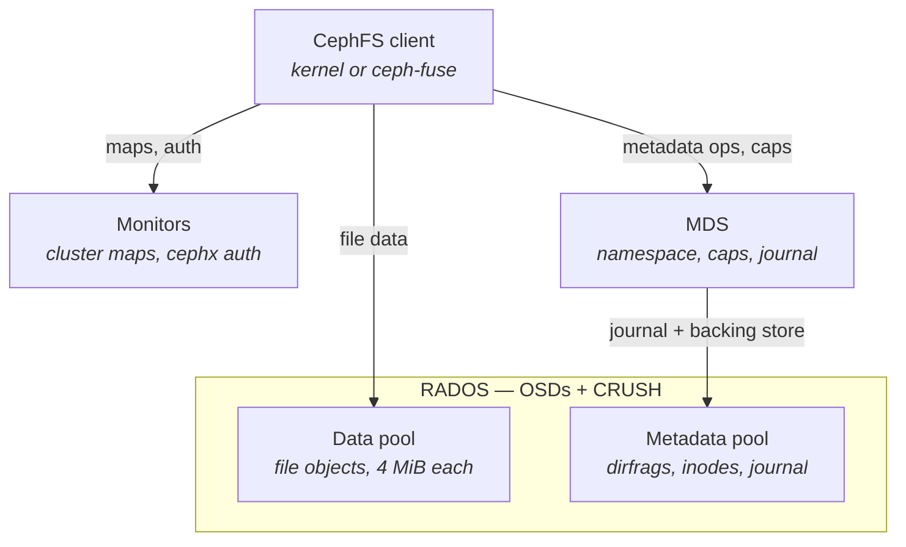
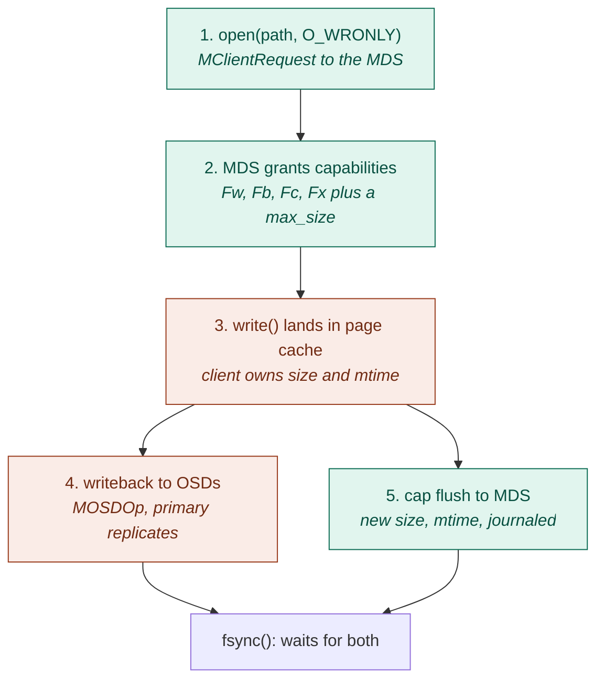
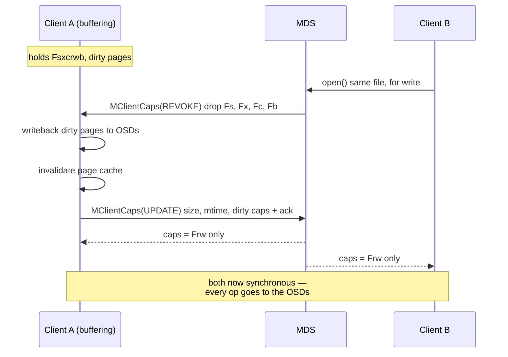

* TOC
{:toc}

CephFS is a POSIX filesystem layered on top of RADOS, with one design decision that drives
everything else: **metadata goes through the MDS, file data does not**. Clients talk to OSDs
directly for bytes.

# 1. Component architecture

**MDS (metadata server).** Holds an in-memory cache of inodes, dentries and dirfrags
(`CInode`, `CDentry`, `CDir`), and is the arbiter of who may cache what. It is not a storage
server — everything it owns is persisted into the metadata pool. Writes go first to a journal: a
chain of sequential RADOS objects in the metadata pool, named `<0x200 + rank>.<objno>` (the log
inode is `MDS_INO_LOG_OFFSET + rank`), so rank 0 gets `200.00000000` for the header and
`200.00000001` onward for payload. It is a chain, not a stripe set — the default log layout keeps
`stripe_count = 1`. Dirty metadata is later flushed to backing objects: a directory fragment
becomes one object whose omap keys are the dentries. Each file also carries its *backtrace* in an
xattr literally named `parent`, on the file's first data object in the **data** pool, so the path
can be reconstructed during disaster recovery.

With multiple active MDS ranks, the namespace is split by **dynamic subtree partitioning** — each
rank owns a set of subtrees, and hot subtrees are exported between ranks at runtime.

**Data layout.** A file's contents are striped over objects named
`<inode-hex>.<object-number-hex>`, the second field zero-padded to 8 digits (`"%llx.%08llx"`),
default `stripe_unit = object_size = 4 MiB`, `stripe_count = 1`. So offset 13 MiB in inode
`0x10000000abc` lives in object `10000000abc.00000003` at offset 1 MiB. The client computes this
locally: object name → PG via hash, PG → OSD set via CRUSH using its cached osdmap. No per-block
metadata lookup ever happens, which is why the MDS is not on the data path.

# 2. Protocol surfaces

| Channel | Messages | Purpose |
|---|---|---|
| Client&nbsp;↔&nbsp;MON | `MMonSubscribe`, `MOSDMap`, `MMDSMap`, cephx auth | maps, keys, blocklist state |
| Client&nbsp;↔&nbsp;MDS | `MClientSession`, `MClientRequest` / `MClientReply`, `MClientCaps`, `MClientCapRelease`, `MClientLease`, `MClientSnap`, `MClientReconnect` | lookup, open, create, rename, readdir, cap grant/revoke/flush |
| Client&nbsp;↔&nbsp;OSD | `MOSDOp` / `MOSDOpReply` | read, sparse-read, write, truncate, per-object atomic transactions |
| MDS&nbsp;↔&nbsp;MDS | `MExportDir*`, `MMDSPeerRequest`, `MDentryLink/Unlink` | subtree migration, multi-rank ops such as cross-rank rename |
| MDS&nbsp;↔&nbsp;OSD | `MOSDOp` | journal append, dirfrag flush |

`MClientRequest` carries an op code (`CEPH_MDS_OP_LOOKUP`, `OPEN`, `CREATE`, `SETATTR`, `UNLINK`,
`RENAME`, `READDIR`…) plus the path or an inode+dentry pair; the reply carries a trace of the
resolved inodes, their metadata, and the capability set granted.

# 3. Write path

Teal steps are the MDS metadata path; coral steps are the direct OSD data path.

Steps 4 and 5 are **not** ordered against each other. `Client::_write_success()` sets `in->size`
and marks the caps dirty as soon as the write lands in the page cache, so a cap flush can carry
the new size to the MDS while the data is still sitting in the ObjectCacher — the MDS's recorded
size routinely runs ahead of what is durable in RADOS. That is safe because a read of a region
nobody has written returns zeros, not stale bytes. `fsync()` is the barrier that forces both
halves: it starts the ObjectCacher flush, sends a synchronous cap flush, then waits on the data
commit and the MDS's flush ack.

Two guards sit around this path:

- **`max_size`** caps how far a client may extend a file before it must ask the MDS for more. This
  keeps the MDS's notion of file size bounded even though the client is mutating it locally.
- **`truncate_seq` / `truncate_size`** ride along in every *extent* OSD op. A write issued before a
  truncate but arriving after it carries a stale `truncate_seq`, and the OSD clamps its length so
  it cannot re-extend the object past the truncated size — it is trimmed, not rejected. A write
  arriving *before* the truncate carries the newer seq and makes the OSD apply the truncate first.

# 4. Read path

The mirror image, and shorter:

1. Path resolution walks the client's dcache, using dentry leases and cached inodes where valid,
   and issues `MClientRequest(LOOKUP)` where not.
2. `open(O_RDONLY)` returns caps including `Fs` (may trust cached size/mtime), `Fc` (may cache
   contents) and `Fr` (may read from OSDs).
3. If the page is present and `Fc` is held, the read never leaves the client.
4. Otherwise the client maps offset → object → PG → OSD and sends `MOSDOp` read to the acting
   primary. Objects that were never written do not exist: the OSD answers `-ENOENT`, the client
   treats that as a zero-length read and zero-fills up to the known EOF, so sparse files cost
   nothing.

If `Fc` has been revoked but `Fr` retained, every read goes synchronously to the OSDs. Losing the
cached *size* is a separate matter: `CEPH_STAT_CAP_SIZE` and `_MTIME` are both `Fs`, so it is the
loss of `Fs` — not of `Fc` — that forces the client to refresh size and mtime from the MDS.
`LOCK_MIX` happens to drop both at once, which is why the two are easy to conflate.

# 5. Capabilities: how coherence is enforced

The MDS hands each client a per-inode **capability** bitmask and remembers exactly who holds what.

| Group | Bits | Meaning |
|---|---|---|
| `p` pin | `p` | `CEPH_CAP_PIN` — the inode is pinned in the MDS cache; every cap string starts with it |
| `A` auth | `As`, `Ax` | mode, uid, gid |
| `L` link | `Ls`, `Lx` | nlink |
| `X` xattr | `Xs`, `Xx` | extended attributes |
| `F` file | `Fs`, `Fx` | read / mutate size, mtime |
| | `Fr`, `Fw` | read / write data at the OSDs |
| | `Fc`, `Fb` | cache reads / buffer writes locally |
| | `Fa` | extend EOF (`CEPH_CAP_GWREXTEND`) — vestigial: it sits in `sm_filelock.allowed_ever_auth` but in no state's cap column, so it is never actually issued |
| | `Fl` | lazy I/O (relaxed coherence) |

The letters are emitted in a fixed order per group — `s x c r w b a l` in `gcap_string()` — so a
cap string is read left to right as pin, then the `A`, `L`, `X` and `F` groups.

A cap set is written like `pAsLsXsFscr` (shared reader) or `pAsxLsxXsxFsxcrwb` (exclusive writer
— `set_loner_cap` drives all four cap locks together, so the loner gets the `X` group too).
The two bits that make coherence work are `Fc` and `Fb`: **they are the licence to keep data
outside RADOS** — along with `Fl`, the LazyIO escape hatch described below, which exists precisely
to keep cached data alive across a revoke.

The exclusivity people assume is enforced is actually emergent. There is no cross-client check
anywhere: `Locker::issue_caps()` computes `(wanted|likes) & allowed` per client independently. Every
`GBUFFER` grant sits in a state's *loner* column, and the loner is by definition the single
non-stale client wanting read/write caps, so two clients never buffer at once in the steady
states. (The `LOCK`/xlock family does put `GCACHE|GBUFFER` in the "any" column, so several clients
can hold `Fcb` there — harmless, since those states grant no `Fr`/`Fw`.) When the loner is about
to lose its status, the MDS revokes.

## Revocation

Revocation is a two-party handshake, not a broadcast. The client must write back dirty pages,
invalidate its cache, flush the dirty metadata bits, and only then ack. Note that the whole loner
set goes, not just the caching bits: the `EXCL`→`MIX` transition runs through `LOCK_EXCL_MIX`,
whose loner column is only `GRD|GWR` — losing `Fs` and `Fx` is precisely *why* size and mtime
revert to MDS authority.

The outcome branches on what is still wanted. `file_eval` picks `MIX` only if a writer remains
(`(other_wanted|loner_wanted) & GWR`); if B had opened read-only and A stopped wanting write, it
takes `simple_sync` instead and both clients settle at `Fscr` — still caching, not synchronous.

What happens to a client that never acks is less decisive than it is usually told.
`Locker::caps_tick()` only raises the `MDS_CLIENT_LATE_RELEASE` health warning, on exponential
backoff — it never evicts. Cap-revoke eviction lives in `Server::evict_cap_revoke_non_responders()`,
which returns immediately unless `mds_cap_revoke_eviction_timeout` is set, and that defaults to
**0 — disabled**. So a client that keeps renewing its session while sitting on the cap stalls the
revoker indefinitely and is only warned about.

The unconditional backstop is the session timeout, not the cap timeout: a client that stops
talking at all loses its session after `session_autoclose` (300s) and is **evicted**, which
blocklists its address in the osdmap so any in-flight OSD write it still had outstanding gets
rejected. That fencing is what makes the model safe rather than merely cooperative — but out of
the box it catches the dead client, not the merely uncooperative one.

## Lock states behind the caps

Underneath, the MDS runs one lock object per group of inode fields — `authlock`, `linklock`,
`xattrlock`, `filelock`, `nestlock` — built from `SimpleLock`, its `ScatterLock` subclass, and
`LocalLockC`. There is no `FileLock` class: `CInode::filelock` is a `ScatterLock`, and what is
file-specific is the state *table*, `sm_filelock` in `locks.c`. The cap sets below are just the
client-visible projection of that table's cap columns:

| State | When | Caps granted | Effect |
|---|---|---|---|
| `LOCK_EXCL` | one client (the *loner*) has it open **for write** | loner `Fsxcrwb`; everyone else `p` | buffered writes, cached reads, local authority over size and mtime — the fast path |
| `LOCK_SYNC` | several readers, no writer | `Fscr` (+`Fl`) | caching safe because nothing changes |
| `LOCK_MIX` | writer plus other openers | `Frw` (+`Fl`) | all I/O synchronous; size/mtime authoritative at the MDS via scatter lock |

`Fx` in the `LOCK_EXCL` row is the bit that actually confers the local authority over size and
mtime, and it is granted to the loner only — the non-loner column for that state is empty.

`LOCK_MIX` is the state people hit when they wonder why CephFS "got slow". Correctness is
preserved at real cost.

## Adjacent mechanisms

- **Dentry leases** (`MClientLease`) cover name→inode bindings, including negative entries, so a
  `stat()` on a nonexistent path doesn't hit the MDS every time. They *are* granted explicitly —
  `encode_lease` in the reply trace — but with a fixed 30s duration instead of being held
  open-endedly like a cap, and the MDS can still revoke one early with `MClientLease(REVOKE)`. No
  lease is issued at all when the client already holds `Fs`/`Fx` on the parent directory, since
  the directory caps already cover it.
- **Directory completeness**: a client holding shared caps on a directory that has read every
  dentry sets a "complete" flag and can serve `readdir` and lookups entirely from cache. Any
  modification by another client revokes it.
- **`LazyIO` / `Fl`** deliberately opts out of `Fb`/`Fc` revocation for HPC-style applications that
  coordinate their own consistency (e.g. MPI-IO with disjoint ranges). It trades POSIX coherence
  for throughput and must be requested explicitly.
- **MDS restart**: clients replay their state with `MClientReconnect`, telling the new rank which
  inodes and caps they held, so the cache is rebuilt without a global flush.

# 6. The transferable mental model

Capabilities are the same idea as SMB oplocks or NFSv4 delegations, but split into independent
bits per metadata field, and with the data path deliberately routed around the server that
issues them.


